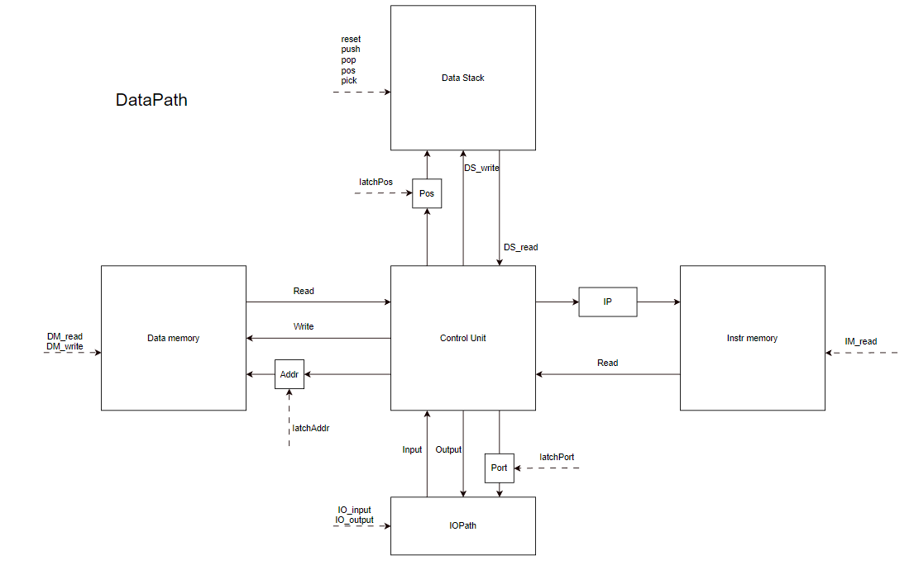
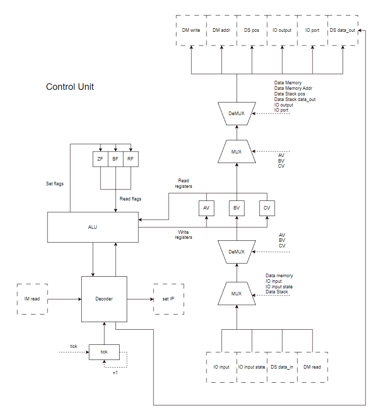

# Документация

## О документе:
* Автор:
  * Кокорев Михаил Дмитриевич P3219
* Вариант:
  * Базовый вариант
  * `asm - stack - harv - hw - tick - struct - trap - port - cstr - prob2 - cache`


## Система команд:

Описание команд представлено в виде:
* `Команда` - описание механизма работы:
  * `Состояние стека до выполнения команды --> Состояние стека после выполнения команды`
  * Дополнительные комментария и пояснения по работе команд. (опционально)
  * Дополнительные комментарии не являются этапами работы команд в модели!


### Стековые операции:
* `load` - записывает на вершину стека значение из памяти, используя вершину стека как адрес:
  * `A --> M`
  * Значение `А` используется как адрес и будет убран с вершины стека. 
  * Значение `М` было прочитано из памяти и будет добавлено на вершину стека.
* `save` - сохраняет данные в память. Использует первые два элемента стека как адрес и значение:
  * `A N --> _`
  * Адрес `А` будет убран с вершины стека. 
  * Значение `N` будет убрано с вершины стека и записано в память по адресу `А`.
* `push <N_or_label>` - записывает на вершину стека число или метку: 
  * `--> N_or_A`
  * Складывается либо число либо метка (Адрес)
* `drop` - убирает вершину стека:
  * `N --> _`
  * Значение `N` будет убрано с вершины стека.
* `dup` - дублирует вершину стека: 
  * `N -> N N`
  * Копия значения `N` с вершины стека будет записана на вершину стека.
* `swap` - меняет местами два верхних элемента стека: 
  * `N V --> V N`
* `over` - кладет копию следующего после вершины стека числа на вершину стека: 
  * `N V -> V N V`
  * Копия значения `V` из второго элемента стека будет записана на вершину стека.
* `rol` - смещает по-кругу первые три элемента стека: 
  * `N X V --> V N X`
  * Первый элемент становится вторым. Второй - третьим. Третий - Первым.
* `pushf` - помещает флаги на вершину стека: 
  * `_ --> BF ZF`
* `popf` - убирает флаги с вершины стека: 
  * `BF ZF --> _`

### Арифметические операции:
* `add` - складывает два верхних элемента стека:
  * `N M -> N+M`
  * Значение `N` будет убрано с вершины стека.
  * Значение `M` будет убрано из стека.
  * Значение `N+M` будет добавлено на вершину стека.
* `sub` - вычитает из вершины стека следующий за ним элемент:
  * `N M -> N-M`
  * Значение `N` будет убрано с вершины стека.
  * Значение `M` будет убрано из стека.
  * Значение `N-M` будет добавлено на вершину стека.
* `mul` - перемножает первые два элемента стека:
  * `N M -> N*M`
  * Значение `N` будет убрано с вершины стека.
  * Значение `M` будет убрано из стека.
  * Значение `N*M` будет добавлено на вершину стека.
* `div` - делит первый элемент стека на второй элемент стека:
  * `N M -> N/M`
  * Значение `N` будет убрано с вершины стека.
  * Значение `M` будет убрано из стека.
  * Значение `N/M` будет добавлено на вершину стека.
* `mod` - вычисляет остаток от деления вершины стека на следующий за ним элемент:
  * `N M -> N%M`
  * Значение `N` будет убрано с вершины стека.
  * Значение `M` будет убрано из стека.
  * Значение `NM` будет добавлено на вершину стека.

### Операции сравнения:
* `cmp` - сравнивает два верхних элемента стека, устанавливает флаги по резульату сравнения:
  * `N M --> M ?ZF(N == M) ?BF(N < M)`
  * Сравнивает два верхних числа
  * Значение `N` будет убрано с вершины стека.
  * Будут выставлены флаги ZF и BF в регистр флагов

### control flow operations:
* `jump <label>` - безусловный переход на метку.
* `jz <label>` - переход на метку, если флаг ZF выставлен.
* `jb <label>` - переход на метку, если флаг BF выставлен.
* `halt` - завершение программы
* `ret` - возвращение на адрес А, указанный на вершине стека: 
  * `A --> _ ; IP=A`
  * Адрес `А` будет убран с вершины стека. 

### Операции ввода/вывода:
* `in` - читает значение из порта `P`:
  * `P --> V`
  * Значение `P` будет убрано с вершины стека.
  * Значение `V` будет добавлено на вершину стека.
* `out` - записывает значение в порт `P`:
  * `P V --> _`
  * Значение `P` будет убрано с вершины стека.
  * Значение `V` будет убрано из стека и записано в порт `P`.

### Доступные порты:
* 0 - ввод
* 1 - вывод
* 2 - состояние потока ввода: 0 - закрыт, !0 - открыт

### Поддерживаемые флаги:
* ZF - устанавливается командой `cmp` если два верхних элемента стека равны.
* BF - устанавливается командой `cmp` если верхний элемент стека меньше следующего.
* RF - устанавливается CU когда происходит прерывание.

### Внутренние регистры:
* IP - регистр счетчика команд 
* AV - внутренний регистр АЛУ (общего назначения)
* BV - внутренний регистр АЛУ (общего назначения)
* CV - внутренний регистр АЛУ (общего назначения)

### Формат определения данных:
* `label = <N1> ... <Nx>`

## Синтаксис языка:

```
line ::= comment_or_none 
            | variable numbers comment_or_none 
            | label_or_none comment_or_none
            | label_or_none command comment_or_none

comment_or_none := <EMPTY> | comment
comment ::= ';'string

string ::= <ASCII> | <ASCII>string
word ::= <LETTER_DIGIT> | <LETTER_DIGIT>word 

label_or_none ::= <EMPTY> | label
label ::= word':'

variable ::= word'='

digits ::= <DIGIT> | <DIGIT>digits
number ::= '+'digits | '-'digits | digits
numbers ::= <EMPTY> | number numbers
number_or_variable ::= number | word

command ::= command_without_arg
            | command_with_arg number_or_variable
            | command_with_label label

command_without_arg ::= 'dup'
            | 'swap'
            | 'rol'
            | 'add'
            | 'mul'
            | 'dec'
            | 'cmp'
            | 'halt'
            | 'in'
            | 'out'
            | 'ret'

command_with_arg ::= 'push'

command_with_label ::= 'jump'
            | 'je'
            | 'jb' 
```

## Семантика языка:

### Стратегия вычислений:
- строгие вычисления.
- пошаговое выполнение.

### Область видимости:
- глобальная видимость в единственном стеке

### Типизация:
- только знаковые целочисленные (64 битовые)

## I/O прерывания
### Процедура:
1. Помещается IP на вершину стека: `--> IP`
2. Переходит на начало вектора прерывания

### Предопределенные метки:
- `main:` - точка начала исполнения программы
- `interrupt:` - точка начала вектора прерывания

### Попытка прерывать прерывание:
- повторные прерывания игнорировать до окончания текущего.

# Модель
## Транслятор

Реализован в модуле [Translator.py](translator%2FTranslator.py):

- Машинные инструкции транслируются в дамп памяти команд.
- Константы и данные транслируются в дамп памяти данных.
- Машинный код представляет собой набор байт.

Запуск транслятора:\
`translator_cli [-h] [--log_name LOG_NAME] [--log_level {DEBUG,INFO,WARN,ERROR,FATAL}] source destination`

## Организация памяти

### Основная память

* DRAM
* Архитектура: гарвардская - данные и команды находятся в разных сегментах памяти.
Влияние команд на память команд невозможно.
* Размер одной ячейки памяти - 64 бита
* В ячейках памяти хранятся строго знаковые целочисленные.
* Адресация - прямая абсолютная, поддерживается прямая загрузка на стек.

### Стек

* 64-разрядный
* Аппаратно представляет собой DRAM память + регистр-указатель вершины стека, который по сигналу ин(де-)крементируется.
* Глобальный стек данных.
* Нет регистров доступных программе.

## Модель Процессора

Реализован в модуле [Machine.py](machine%2FMachine.py):
- Программа начинается с `main:`
- Программа завершается по достижению команды `hlt`
- Процесс моделирования – потактовый, каждый такт выводится в файл логирования
- Начало симуляции происходит в функции `simulation`

Запуск процессора:\
`machine_cli [-h] [--log_name LOG_NAME] [--log_level {DEBUG,INFO,WARN,ERROR,FATAL}] program input`

### Схемы



Устройства схемы "DataPath":
* Control Unit 
* Data Memory - память данных
* Data Stack - стек для работы с данными
* Instr Memory - память команд(инструкций)
* IOPath - внешние устройства (ввод, вывод)
* Регистр
  * IP - регистр инструкций
* Буферы-Регистры
  * Addr - адрес данных
  * Port - порт внешнего устройства
  * Pos - позиция в стеке



Устройства схемы "Control Unit":
* Decoder - выполняет работу над инструкциями.
  * читает инструкцию из памяти команд.
  * выполняет инструкцию.
  * Обновляет регистр IP на следующую команду.
* ALU - арифметическо-логическое устройство. Проводит математические операции с регистрами.
* tick - генератор тиков
* Флаги - набор флагов
  * ZF - флаг сравнения (равно)
  * BF - флаг сравнения (больше)
  * RF - флаг прерывания
* Регистры доступные для выполнения операций ALU
  * AV - регистр общего назначения
  * BV - регистр общего назначения
  * CV - регистр общего назначения


### Сигналы схем
- DM_read/DM_write - Чтение/запись в память данных
- latchAddr - фиксация адреса памяти данных
- Работа со стеком
  - pop - достать сверху стека
  - push - положить на верх стека
  - reset - сбросить стек
  - pos - установить указатель стека
  - pick - уменьшить стек или определить переполнение.
- latchPos - фиксация адреса стека
- DS_read/DS_write - чтение/запись в стек памяти.
- IM_read - чтение команд из памяти команд.
- IO_input/IO_output - чтение/запись на внешние устройства.
- latchPort - фиксация номера порта.
- tick - генерация тиков
- установка флагов
  - выставить флаги
  - прочитать флаги
- установка регистров
  - read_register/AV/BV/CV - прочитать из регистра
  - write_register - записать в регистр

# Тестирование

* Тестирование осуществляется при помощи golden test-ов
* Тесты реализованы в модуле [golden_test](golden_test.py)
* Выполняются все тесты в директории [golden](golden)

### Конфигурация тестов
Инициация тестов:
- [pytest.ini](pytest.ini)

Линтеры:
- [check_mypy.sh](ci%2Fcheck_mypy.sh)
- [check_ruff.sh](ci%2Fcheck_ruff.sh)

Запустить тесты: 
- `pytest`

Запустить тесты с выводом журналов в файл:
- `pytest --log-cli-level=DEBUG > result.txt`

CI при помощи [Github Actions](.github/workflows/tests.yaml):

### Примеры журналов выполнения программ:

<details>
<summary> Журнал выполнения программы hello</summary>

```text
  -------------------------------- live log call --------------------------------
  DEBUG    S:Machine.py:30 ----------------
  DEBUG    S:ControlUnit.py:68   Control Unit: tik=0 HLT=False IP=0  AV=0 BV=0 CV=0  ZF=False BF=False RF=False  ignored INTs=0
  DEBUG    S:DataStack.py:43     Data stack: PR=0 top[  ]bottom
  DEBUG    S:DataMemory.py:25    Data memory: AR=0  memory[AR]=72
  DEBUG    S:IOPath.py:78        I/O path: ports=[0 0 0 1] 
  DEBUG    machine.Decoder:Decoder.py:24 decode: jump{ 2 }
  DEBUG    S:Machine.py:30 ----------------
  DEBUG    S:ControlUnit.py:68   Control Unit: tik=1 HLT=False IP=2  AV=0 BV=0 CV=0  ZF=False BF=False RF=False  ignored INTs=0
  DEBUG    S:DataStack.py:43     Data stack: PR=0 top[  ]bottom
  DEBUG    S:DataMemory.py:25    Data memory: AR=0  memory[AR]=72
  DEBUG    S:IOPath.py:78        I/O path: ports=[0 0 0 1] 
  DEBUG    machine.Decoder:Decoder.py:24 decode: push{ 0 }
  DEBUG    S:Machine.py:30 ----------------
  DEBUG    S:ControlUnit.py:68   Control Unit: tik=2 HLT=False IP=3  AV=0 BV=0 CV=0  ZF=False BF=False RF=False  ignored INTs=0
  DEBUG    S:DataStack.py:43     Data stack: PR=0 top[ 0 ]bottom
  DEBUG    S:DataMemory.py:25    Data memory: AR=0  memory[AR]=72
  DEBUG    S:IOPath.py:78        I/O path: ports=[0 0 0 1] 
  DEBUG    machine.Decoder:Decoder.py:24 decode: dup
  DEBUG    S:Machine.py:30 ----------------
  DEBUG    S:ControlUnit.py:68   Control Unit: tik=3 HLT=False IP=4  AV=0 BV=0 CV=0  ZF=False BF=False RF=False  ignored INTs=0
  DEBUG    S:DataStack.py:43     Data stack: PR=0 top[  ]bottom
  DEBUG    S:DataMemory.py:25    Data memory: AR=0  memory[AR]=72
  DEBUG    S:IOPath.py:78        I/O path: ports=[0 0 0 1] 
  DEBUG    S:Machine.py:30 ----------------
  DEBUG    S:ControlUnit.py:68   Control Unit: tik=4 HLT=False IP=4  AV=0 BV=0 CV=0  ZF=False BF=False RF=False  ignored INTs=0
  DEBUG    S:DataStack.py:43     Data stack: PR=0 top[ 0 ]bottom
  DEBUG    S:DataMemory.py:25    Data memory: AR=0  memory[AR]=72
  DEBUG    S:IOPath.py:78        I/O path: ports=[0 0 0 1] 
  DEBUG    S:Machine.py:30 ----------------
  DEBUG    S:ControlUnit.py:68   Control Unit: tik=5 HLT=False IP=4  AV=0 BV=0 CV=0  ZF=False BF=False RF=False  ignored INTs=0
  DEBUG    S:DataStack.py:43     Data stack: PR=0 top[ 0 0 ]bottom
  DEBUG    S:DataMemory.py:25    Data memory: AR=0  memory[AR]=72
  DEBUG    S:IOPath.py:78        I/O path: ports=[0 0 0 1] 
  DEBUG    machine.Decoder:Decoder.py:24 decode: load
  DEBUG    S:Machine.py:30 ----------------
  DEBUG    S:ControlUnit.py:68   Control Unit: tik=6 HLT=False IP=5  AV=0 BV=0 CV=0  ZF=False BF=False RF=False  ignored INTs=0
  DEBUG    S:DataStack.py:43     Data stack: PR=0 top[ 0 ]bottom
  DEBUG    S:DataMemory.py:25    Data memory: AR=0  memory[AR]=72
  DEBUG    S:IOPath.py:78        I/O path: ports=[0 0 0 1] 
  DEBUG    S:Machine.py:30 ----------------
  DEBUG    S:ControlUnit.py:68   Control Unit: tik=7 HLT=False IP=5  AV=0 BV=0 CV=0  ZF=False BF=False RF=False  ignored INTs=0
  DEBUG    S:DataStack.py:43     Data stack: PR=0 top[ 0 ]bottom
  DEBUG    S:DataMemory.py:25    Data memory: AR=0  memory[AR]=72
  DEBUG    S:IOPath.py:78        I/O path: ports=[0 0 0 1] 
  DEBUG    S:Machine.py:30 ----------------
  DEBUG    S:ControlUnit.py:68   Control Unit: tik=8 HLT=False IP=5  AV=72 BV=0 CV=0  ZF=False BF=False RF=False  ignored INTs=0
  DEBUG    S:DataStack.py:43     Data stack: PR=0 top[ 0 ]bottom
  DEBUG    S:DataMemory.py:25    Data memory: AR=0  memory[AR]=72
  DEBUG    S:IOPath.py:78        I/O path: ports=[0 0 0 1] 
  DEBUG    S:Machine.py:30 ----------------
  DEBUG    S:ControlUnit.py:68   Control Unit: tik=9 HLT=False IP=5  AV=72 BV=0 CV=0  ZF=False BF=False RF=False  ignored INTs=0
  DEBUG    S:DataStack.py:43     Data stack: PR=0 top[ 72 0 ]bottom
  DEBUG    S:DataMemory.py:25    Data memory: AR=0  memory[AR]=72
  DEBUG    S:IOPath.py:78        I/O path: ports=[0 0 0 1] 
  DEBUG    machine.Decoder:Decoder.py:24 decode: push{ 0 }
  DEBUG    S:Machine.py:30 ----------------
  DEBUG    S:ControlUnit.py:68   Control Unit: tik=10 HLT=False IP=6  AV=72 BV=0 CV=0  ZF=False BF=False RF=False  ignored INTs=0
  DEBUG    S:DataStack.py:43     Data stack: PR=0 top[ 0 72 0 ]bottom
  DEBUG    S:DataMemory.py:25    Data memory: AR=0  memory[AR]=72
  DEBUG    S:IOPath.py:78        I/O path: ports=[0 0 0 1] 
  DEBUG    machine.Decoder:Decoder.py:24 decode: cmp
  DEBUG    S:Machine.py:30 ----------------
  DEBUG    S:ControlUnit.py:68   Control Unit: tik=11 HLT=False IP=7  AV=0 BV=0 CV=0  ZF=False BF=False RF=False  ignored INTs=0
  DEBUG    S:DataStack.py:43     Data stack: PR=0 top[ 72 0 ]bottom
  DEBUG    S:DataMemory.py:25    Data memory: AR=0  memory[AR]=72
  DEBUG    S:IOPath.py:78        I/O path: ports=[0 0 0 1] 
  DEBUG    S:Machine.py:30 ----------------
  DEBUG    S:ControlUnit.py:68   Control Unit: tik=12 HLT=False IP=7  AV=0 BV=0 CV=0  ZF=False BF=False RF=False  ignored INTs=0
  DEBUG    S:DataStack.py:43     Data stack: PR=0 top[ 72 0 ]bottom
  DEBUG    S:DataMemory.py:25    Data memory: AR=0  memory[AR]=72
  DEBUG    S:IOPath.py:78        I/O path: ports=[0 0 0 1] 
  DEBUG    S:Machine.py:30 ----------------
  DEBUG    S:ControlUnit.py:68   Control Unit: tik=13 HLT=False IP=7  AV=0 BV=0 CV=0  ZF=False BF=False RF=False  ignored INTs=0
  DEBUG    S:DataStack.py:43     Data stack: PR=0 top[ 72 0 ]bottom
  DEBUG    S:DataMemory.py:25    Data memory: AR=0  memory[AR]=72
  DEBUG    S:IOPath.py:78        I/O path: ports=[0 0 0 1] 
  DEBUG    S:Machine.py:30 ----------------
  DEBUG    S:ControlUnit.py:68   Control Unit: tik=14 HLT=False IP=7  AV=0 BV=72 CV=0  ZF=False BF=False RF=False  ignored INTs=0
  DEBUG    S:DataStack.py:43     Data stack: PR=0 top[ 72 0 ]bottom
  DEBUG    S:DataMemory.py:25    Data memory: AR=0  memory[AR]=72
  DEBUG    S:IOPath.py:78        I/O path: ports=[0 0 0 1] 
  DEBUG    S:Machine.py:30 ----------------
  DEBUG    S:ControlUnit.py:68   Control Unit: tik=15 HLT=False IP=7  AV=0 BV=72 CV=0  ZF=False BF=True RF=False  ignored INTs=0
  DEBUG    S:DataStack.py:43     Data stack: PR=0 top[ 72 0 ]bottom
  DEBUG    S:DataMemory.py:25    Data memory: AR=0  memory[AR]=72
  DEBUG    S:IOPath.py:78        I/O path: ports=[0 0 0 1] 
  DEBUG    machine.Decoder:Decoder.py:24 decode: jz{ 13 }
  DEBUG    S:Machine.py:30 ----------------
  DEBUG    S:ControlUnit.py:68   Control Unit: tik=16 HLT=False IP=8  AV=0 BV=72 CV=0  ZF=False BF=True RF=False  ignored INTs=0
  DEBUG    S:DataStack.py:43     Data stack: PR=0 top[ 72 0 ]bottom
  DEBUG    S:DataMemory.py:25    Data memory: AR=0  memory[AR]=72
  DEBUG    S:IOPath.py:78        I/O path: ports=[0 0 0 1] 
  DEBUG    machine.Decoder:Decoder.py:24 decode: push{ 1 }
  DEBUG    S:Machine.py:30 ----------------
  DEBUG    S:ControlUnit.py:68   Control Unit: tik=17 HLT=False IP=9  AV=0 BV=72 CV=0  ZF=False BF=True RF=False  ignored INTs=0
  DEBUG    S:DataStack.py:43     Data stack: PR=0 top[ 1 72 0 ]bottom
  DEBUG    S:DataMemory.py:25    Data memory: AR=0  memory[AR]=72
  DEBUG    S:IOPath.py:78        I/O path: ports=[0 0 0 1] 
  DEBUG    machine.Decoder:Decoder.py:24 decode: out
  DEBUG    S:Machine.py:30 ----------------
  DEBUG    S:ControlUnit.py:68   Control Unit: tik=18 HLT=False IP=10  AV=1 BV=72 CV=0  ZF=False BF=True RF=False  ignored INTs=0
  DEBUG    S:DataStack.py:43     Data stack: PR=0 top[ 72 0 ]bottom
  DEBUG    S:DataMemory.py:25    Data memory: AR=0  memory[AR]=72
  DEBUG    S:IOPath.py:78        I/O path: ports=[0 0 0 1] 
  DEBUG    S:Machine.py:30 ----------------
  DEBUG    S:ControlUnit.py:68   Control Unit: tik=19 HLT=False IP=10  AV=1 BV=72 CV=0  ZF=False BF=True RF=False  ignored INTs=0
  DEBUG    S:DataStack.py:43     Data stack: PR=0 top[ 0 ]bottom
  DEBUG    S:DataMemory.py:25    Data memory: AR=0  memory[AR]=72
  DEBUG    S:IOPath.py:78        I/O path: ports=[0 0 0 1] 
  DEBUG    S:Machine.py:30 ----------------
  DEBUG    S:ControlUnit.py:68   Control Unit: tik=20 HLT=False IP=10  AV=1 BV=72 CV=0  ZF=False BF=True RF=False  ignored INTs=0
  DEBUG    S:DataStack.py:43     Data stack: PR=0 top[ 0 ]bottom
  DEBUG    S:DataMemory.py:25    Data memory: AR=0  memory[AR]=72
  DEBUG    S:IOPath.py:78        I/O path: ports=[0 72 0 1] 
  DEBUG    machine.Decoder:Decoder.py:24 decode: push{ 1 }
  DEBUG    S:Machine.py:30 ----------------
  DEBUG    S:ControlUnit.py:68   Control Unit: tik=21 HLT=False IP=11  AV=1 BV=72 CV=0  ZF=False BF=True RF=False  ignored INTs=0
  DEBUG    S:DataStack.py:43     Data stack: PR=0 top[ 1 0 ]bottom
  DEBUG    S:DataMemory.py:25    Data memory: AR=0  memory[AR]=72
  DEBUG    S:IOPath.py:78        I/O path: ports=[0 72 0 1] 
  DEBUG    machine.Decoder:Decoder.py:24 decode: add
  DEBUG    S:Machine.py:30 ----------------
  DEBUG    S:ControlUnit.py:68   Control Unit: tik=22 HLT=False IP=12  AV=1 BV=72 CV=0  ZF=False BF=True RF=False  ignored INTs=0
  DEBUG    S:DataStack.py:43     Data stack: PR=0 top[ 0 ]bottom
  DEBUG    S:DataMemory.py:25    Data memory: AR=0  memory[AR]=72
  DEBUG    S:IOPath.py:78        I/O path: ports=[0 72 0 1] 
  DEBUG    S:Machine.py:30 ----------------
  DEBUG    S:ControlUnit.py:68   Control Unit: tik=23 HLT=False IP=12  AV=1 BV=0 CV=0  ZF=False BF=True RF=False  ignored INTs=0
  DEBUG    S:DataStack.py:43     Data stack: PR=0 top[  ]bottom
  DEBUG    S:DataMemory.py:25    Data memory: AR=0  memory[AR]=72
  DEBUG    S:IOPath.py:78        I/O path: ports=[0 72 0 1] 
  DEBUG    S:Machine.py:30 ----------------
  DEBUG    S:ControlUnit.py:68   Control Unit: tik=24 HLT=False IP=12  AV=1 BV=0 CV=1  ZF=False BF=True RF=False  ignored INTs=0
  DEBUG    S:DataStack.py:43     Data stack: PR=0 top[  ]bottom
  DEBUG    S:DataMemory.py:25    Data memory: AR=0  memory[AR]=72
  DEBUG    S:IOPath.py:78        I/O path: ports=[0 72 0 1] 
  DEBUG    S:Machine.py:30 ----------------
  DEBUG    S:ControlUnit.py:68   Control Unit: tik=25 HLT=False IP=12  AV=1 BV=0 CV=1  ZF=False BF=True RF=False  ignored INTs=0
  DEBUG    S:DataStack.py:43     Data stack: PR=0 top[ 1 ]bottom
  DEBUG    S:DataMemory.py:25    Data memory: AR=0  memory[AR]=72
  DEBUG    S:IOPath.py:78        I/O path: ports=[0 72 0 1] 
  DEBUG    machine.Decoder:Decoder.py:24 decode: jump{ 3 }
  DEBUG    S:Machine.py:30 ----------------
  DEBUG    S:ControlUnit.py:68   Control Unit: tik=26 HLT=False IP=3  AV=1 BV=0 CV=1  ZF=False BF=True RF=False  ignored INTs=0
  DEBUG    S:DataStack.py:43     Data stack: PR=0 top[ 1 ]bottom
  DEBUG    S:DataMemory.py:25    Data memory: AR=0  memory[AR]=72
  DEBUG    S:IOPath.py:78        I/O path: ports=[0 72 0 1] 
  DEBUG    machine.Decoder:Decoder.py:24 decode: dup
  DEBUG    S:Machine.py:30 ----------------
  DEBUG    S:ControlUnit.py:68   Control Unit: tik=27 HLT=False IP=4  AV=1 BV=0 CV=1  ZF=False BF=True RF=False  ignored INTs=0
  DEBUG    S:DataStack.py:43     Data stack: PR=0 top[  ]bottom
  DEBUG    S:DataMemory.py:25    Data memory: AR=0  memory[AR]=72
  DEBUG    S:IOPath.py:78        I/O path: ports=[0 72 0 1] 
  DEBUG    S:Machine.py:30 ----------------
  DEBUG    S:ControlUnit.py:68   Control Unit: tik=28 HLT=False IP=4  AV=1 BV=0 CV=1  ZF=False BF=True RF=False  ignored INTs=0
  DEBUG    S:DataStack.py:43     Data stack: PR=0 top[ 1 ]bottom
  DEBUG    S:DataMemory.py:25    Data memory: AR=0  memory[AR]=72
  DEBUG    S:IOPath.py:78        I/O path: ports=[0 72 0 1] 
  DEBUG    S:Machine.py:30 ----------------
  DEBUG    S:ControlUnit.py:68   Control Unit: tik=29 HLT=False IP=4  AV=1 BV=0 CV=1  ZF=False BF=True RF=False  ignored INTs=0
  DEBUG    S:DataStack.py:43     Data stack: PR=0 top[ 1 1 ]bottom
  DEBUG    S:DataMemory.py:25    Data memory: AR=0  memory[AR]=72
  DEBUG    S:IOPath.py:78        I/O path: ports=[0 72 0 1] 
  DEBUG    machine.Decoder:Decoder.py:24 decode: load
  DEBUG    S:Machine.py:30 ----------------
  DEBUG    S:ControlUnit.py:68   Control Unit: tik=30 HLT=False IP=5  AV=1 BV=0 CV=1  ZF=False BF=True RF=False  ignored INTs=0
  DEBUG    S:DataStack.py:43     Data stack: PR=0 top[ 1 ]bottom
  DEBUG    S:DataMemory.py:25    Data memory: AR=0  memory[AR]=72
  DEBUG    S:IOPath.py:78        I/O path: ports=[0 72 0 1] 
  DEBUG    S:Machine.py:30 ----------------
  DEBUG    S:ControlUnit.py:68   Control Unit: tik=31 HLT=False IP=5  AV=1 BV=0 CV=1  ZF=False BF=True RF=False  ignored INTs=0
  DEBUG    S:DataStack.py:43     Data stack: PR=0 top[ 1 ]bottom
  DEBUG    S:DataMemory.py:25    Data memory: AR=1  memory[AR]=101
  DEBUG    S:IOPath.py:78        I/O path: ports=[0 72 0 1] 
  DEBUG    S:Machine.py:30 ----------------
  DEBUG    S:ControlUnit.py:68   Control Unit: tik=32 HLT=False IP=5  AV=101 BV=0 CV=1  ZF=False BF=True RF=False  ignored INTs=0
  DEBUG    S:DataStack.py:43     Data stack: PR=0 top[ 1 ]bottom
  DEBUG    S:DataMemory.py:25    Data memory: AR=1  memory[AR]=101
  DEBUG    S:IOPath.py:78        I/O path: ports=[0 72 0 1] 
  DEBUG    S:Machine.py:30 ----------------
  DEBUG    S:ControlUnit.py:68   Control Unit: tik=33 HLT=False IP=5  AV=101 BV=0 CV=1  ZF=False BF=True RF=False  ignored INTs=0
  DEBUG    S:DataStack.py:43     Data stack: PR=0 top[ 101 1 ]bottom
  DEBUG    S:DataMemory.py:25    Data memory: AR=1  memory[AR]=101
  DEBUG    S:IOPath.py:78        I/O path: ports=[0 72 0 1] 
  DEBUG    machine.Decoder:Decoder.py:24 decode: push{ 0 }
  DEBUG    S:Machine.py:30 ----------------
  DEBUG    S:ControlUnit.py:68   Control Unit: tik=34 HLT=False IP=6  AV=101 BV=0 CV=1  ZF=False BF=True RF=False  ignored INTs=0
  DEBUG    S:DataStack.py:43     Data stack: PR=0 top[ 0 101 1 ]bottom
  DEBUG    S:DataMemory.py:25    Data memory: AR=1  memory[AR]=101
  DEBUG    S:IOPath.py:78        I/O path: ports=[0 72 0 1] 
  DEBUG    machine.Decoder:Decoder.py:24 decode: cmp
  DEBUG    S:Machine.py:30 ----------------
  DEBUG    S:ControlUnit.py:68   Control Unit: tik=35 HLT=False IP=7  AV=0 BV=0 CV=1  ZF=False BF=True RF=False  ignored INTs=0
  DEBUG    S:DataStack.py:43     Data stack: PR=0 top[ 101 1 ]bottom
  DEBUG    S:DataMemory.py:25    Data memory: AR=1  memory[AR]=101
  DEBUG    S:IOPath.py:78        I/O path: ports=[0 72 0 1] 
  DEBUG    S:Machine.py:30 ----------------
  DEBUG    S:ControlUnit.py:68   Control Unit: tik=36 HLT=False IP=7  AV=0 BV=0 CV=1  ZF=False BF=True RF=False  ignored INTs=0
  DEBUG    S:DataStack.py:43     Data stack: PR=0 top[ 101 1 ]bottom
  DEBUG    S:DataMemory.py:25    Data memory: AR=1  memory[AR]=101
  DEBUG    S:IOPath.py:78        I/O path: ports=[0 72 0 1] 
  DEBUG    S:Machine.py:30 ----------------
  DEBUG    S:ControlUnit.py:68   Control Unit: tik=37 HLT=False IP=7  AV=0 BV=0 CV=1  ZF=False BF=True RF=False  ignored INTs=0
  DEBUG    S:DataStack.py:43     Data stack: PR=0 top[ 101 1 ]bottom
  DEBUG    S:DataMemory.py:25    Data memory: AR=1  memory[AR]=101
  DEBUG    S:IOPath.py:78        I/O path: ports=[0 72 0 1] 
  DEBUG    S:Machine.py:30 ----------------
  DEBUG    S:ControlUnit.py:68   Control Unit: tik=38 HLT=False IP=7  AV=0 BV=101 CV=1  ZF=False BF=True RF=False  ignored INTs=0
  DEBUG    S:DataStack.py:43     Data stack: PR=0 top[ 101 1 ]bottom
  DEBUG    S:DataMemory.py:25    Data memory: AR=1  memory[AR]=101
  DEBUG    S:IOPath.py:78        I/O path: ports=[0 72 0 1] 
  DEBUG    S:Machine.py:30 ----------------
  DEBUG    S:ControlUnit.py:68   Control Unit: tik=39 HLT=False IP=7  AV=0 BV=101 CV=1  ZF=False BF=True RF=False  ignored INTs=0
  DEBUG    S:DataStack.py:43     Data stack: PR=0 top[ 101 1 ]bottom
  DEBUG    S:DataMemory.py:25    Data memory: AR=1  memory[AR]=101
  DEBUG    S:IOPath.py:78        I/O path: ports=[0 72 0 1] 
  DEBUG    machine.Decoder:Decoder.py:24 decode: jz{ 13 }
  DEBUG    S:Machine.py:30 ----------------
  DEBUG    S:ControlUnit.py:68   Control Unit: tik=40 HLT=False IP=8  AV=0 BV=101 CV=1  ZF=False BF=True RF=False  ignored INTs=0
  DEBUG    S:DataStack.py:43     Data stack: PR=0 top[ 101 1 ]bottom
  DEBUG    S:DataMemory.py:25    Data memory: AR=1  memory[AR]=101
  DEBUG    S:IOPath.py:78        I/O path: ports=[0 72 0 1] 
  DEBUG    machine.Decoder:Decoder.py:24 decode: push{ 1 }
  DEBUG    S:Machine.py:30 ----------------
  DEBUG    S:ControlUnit.py:68   Control Unit: tik=41 HLT=False IP=9  AV=0 BV=101 CV=1  ZF=False BF=True RF=False  ignored INTs=0
  DEBUG    S:DataStack.py:43     Data stack: PR=0 top[ 1 101 1 ]bottom
  DEBUG    S:DataMemory.py:25    Data memory: AR=1  memory[AR]=101
  DEBUG    S:IOPath.py:78        I/O path: ports=[0 72 0 1] 
  DEBUG    machine.Decoder:Decoder.py:24 decode: out
  DEBUG    S:Machine.py:30 ----------------
  DEBUG    S:ControlUnit.py:68   Control Unit: tik=42 HLT=False IP=10  AV=1 BV=101 CV=1  ZF=False BF=True RF=False  ignored INTs=0
  DEBUG    S:DataStack.py:43     Data stack: PR=0 top[ 101 1 ]bottom
  DEBUG    S:DataMemory.py:25    Data memory: AR=1  memory[AR]=101
  DEBUG    S:IOPath.py:78        I/O path: ports=[0 72 0 1] 
  DEBUG    S:Machine.py:30 ----------------
  DEBUG    S:ControlUnit.py:68   Control Unit: tik=43 HLT=False IP=10  AV=1 BV=101 CV=1  ZF=False BF=True RF=False  ignored INTs=0
  DEBUG    S:DataStack.py:43     Data stack: PR=0 top[ 1 ]bottom
  DEBUG    S:DataMemory.py:25    Data memory: AR=1  memory[AR]=101
  DEBUG    S:IOPath.py:78        I/O path: ports=[0 72 0 1] 
  DEBUG    S:Machine.py:30 ----------------
  DEBUG    S:ControlUnit.py:68   Control Unit: tik=44 HLT=False IP=10  AV=1 BV=101 CV=1  ZF=False BF=True RF=False  ignored INTs=0
  DEBUG    S:DataStack.py:43     Data stack: PR=0 top[ 1 ]bottom
  DEBUG    S:DataMemory.py:25    Data memory: AR=1  memory[AR]=101
  DEBUG    S:IOPath.py:78        I/O path: ports=[0 101 0 1] 
  DEBUG    machine.Decoder:Decoder.py:24 decode: push{ 1 }
  DEBUG    S:Machine.py:30 ----------------
  DEBUG    S:ControlUnit.py:68   Control Unit: tik=45 HLT=False IP=11  AV=1 BV=101 CV=1  ZF=False BF=True RF=False  ignored INTs=0
  DEBUG    S:DataStack.py:43     Data stack: PR=0 top[ 1 1 ]bottom
  DEBUG    S:DataMemory.py:25    Data memory: AR=1  memory[AR]=101
  DEBUG    S:IOPath.py:78        I/O path: ports=[0 101 0 1] 
  DEBUG    machine.Decoder:Decoder.py:24 decode: add
  DEBUG    S:Machine.py:30 ----------------
  DEBUG    S:ControlUnit.py:68   Control Unit: tik=46 HLT=False IP=12  AV=1 BV=101 CV=1  ZF=False BF=True RF=False  ignored INTs=0
  DEBUG    S:DataStack.py:43     Data stack: PR=0 top[ 1 ]bottom
  DEBUG    S:DataMemory.py:25    Data memory: AR=1  memory[AR]=101
  DEBUG    S:IOPath.py:78        I/O path: ports=[0 101 0 1] 
  DEBUG    S:Machine.py:30 ----------------
  DEBUG    S:ControlUnit.py:68   Control Unit: tik=47 HLT=False IP=12  AV=1 BV=1 CV=1  ZF=False BF=True RF=False  ignored INTs=0
  DEBUG    S:DataStack.py:43     Data stack: PR=0 top[  ]bottom
  DEBUG    S:DataMemory.py:25    Data memory: AR=1  memory[AR]=101
  DEBUG    S:IOPath.py:78        I/O path: ports=[0 101 0 1] 
  DEBUG    S:Machine.py:30 ----------------
  DEBUG    S:ControlUnit.py:68   Control Unit: tik=48 HLT=False IP=12  AV=1 BV=1 CV=2  ZF=False BF=True RF=False  ignored INTs=0
  DEBUG    S:DataStack.py:43     Data stack: PR=0 top[  ]bottom
  DEBUG    S:DataMemory.py:25    Data memory: AR=1  memory[AR]=101
  DEBUG    S:IOPath.py:78        I/O path: ports=[0 101 0 1] 
  DEBUG    S:Machine.py:30 ----------------
  DEBUG    S:ControlUnit.py:68   Control Unit: tik=49 HLT=False IP=12  AV=1 BV=1 CV=2  ZF=False BF=True RF=False  ignored INTs=0
  DEBUG    S:DataStack.py:43     Data stack: PR=0 top[ 2 ]bottom
  DEBUG    S:DataMemory.py:25    Data memory: AR=1  memory[AR]=101
  DEBUG    S:IOPath.py:78        I/O path: ports=[0 101 0 1] 
  DEBUG    machine.Decoder:Decoder.py:24 decode: jump{ 3 }
  DEBUG    S:Machine.py:30 ----------------
  DEBUG    S:ControlUnit.py:68   Control Unit: tik=50 HLT=False IP=3  AV=1 BV=1 CV=2  ZF=False BF=True RF=False  ignored INTs=0
  DEBUG    S:DataStack.py:43     Data stack: PR=0 top[ 2 ]bottom
  DEBUG    S:DataMemory.py:25    Data memory: AR=1  memory[AR]=101
  DEBUG    S:IOPath.py:78        I/O path: ports=[0 101 0 1] 
  DEBUG    machine.Decoder:Decoder.py:24 decode: dup
  DEBUG    S:Machine.py:30 ----------------
  DEBUG    S:ControlUnit.py:68   Control Unit: tik=51 HLT=False IP=4  AV=2 BV=1 CV=2  ZF=False BF=True RF=False  ignored INTs=0
  DEBUG    S:DataStack.py:43     Data stack: PR=0 top[  ]bottom
  DEBUG    S:DataMemory.py:25    Data memory: AR=1  memory[AR]=101
  DEBUG    S:IOPath.py:78        I/O path: ports=[0 101 0 1] 
  DEBUG    S:Machine.py:30 ----------------
  DEBUG    S:ControlUnit.py:68   Control Unit: tik=52 HLT=False IP=4  AV=2 BV=1 CV=2  ZF=False BF=True RF=False  ignored INTs=0
  DEBUG    S:DataStack.py:43     Data stack: PR=0 top[ 2 ]bottom
  DEBUG    S:DataMemory.py:25    Data memory: AR=1  memory[AR]=101
  DEBUG    S:IOPath.py:78        I/O path: ports=[0 101 0 1] 
  DEBUG    S:Machine.py:30 ----------------
  DEBUG    S:ControlUnit.py:68   Control Unit: tik=53 HLT=False IP=4  AV=2 BV=1 CV=2  ZF=False BF=True RF=False  ignored INTs=0
  DEBUG    S:DataStack.py:43     Data stack: PR=0 top[ 2 2 ]bottom
  DEBUG    S:DataMemory.py:25    Data memory: AR=1  memory[AR]=101
  DEBUG    S:IOPath.py:78        I/O path: ports=[0 101 0 1] 
  DEBUG    machine.Decoder:Decoder.py:24 decode: load
  DEBUG    S:Machine.py:30 ----------------
  DEBUG    S:ControlUnit.py:68   Control Unit: tik=54 HLT=False IP=5  AV=2 BV=1 CV=2  ZF=False BF=True RF=False  ignored INTs=0
  DEBUG    S:DataStack.py:43     Data stack: PR=0 top[ 2 ]bottom
  DEBUG    S:DataMemory.py:25    Data memory: AR=1  memory[AR]=101
  DEBUG    S:IOPath.py:78        I/O path: ports=[0 101 0 1] 
  DEBUG    S:Machine.py:30 ----------------
  DEBUG    S:ControlUnit.py:68   Control Unit: tik=55 HLT=False IP=5  AV=2 BV=1 CV=2  ZF=False BF=True RF=False  ignored INTs=0
  DEBUG    S:DataStack.py:43     Data stack: PR=0 top[ 2 ]bottom
  DEBUG    S:DataMemory.py:25    Data memory: AR=2  memory[AR]=108
  DEBUG    S:IOPath.py:78        I/O path: ports=[0 101 0 1] 
  DEBUG    S:Machine.py:30 ----------------
  DEBUG    S:ControlUnit.py:68   Control Unit: tik=56 HLT=False IP=5  AV=108 BV=1 CV=2  ZF=False BF=True RF=False  ignored INTs=0
  DEBUG    S:DataStack.py:43     Data stack: PR=0 top[ 2 ]bottom
  DEBUG    S:DataMemory.py:25    Data memory: AR=2  memory[AR]=108
  DEBUG    S:IOPath.py:78        I/O path: ports=[0 101 0 1] 
  DEBUG    S:Machine.py:30 ----------------
  DEBUG    S:ControlUnit.py:68   Control Unit: tik=57 HLT=False IP=5  AV=108 BV=1 CV=2  ZF=False BF=True RF=False  ignored INTs=0
  DEBUG    S:DataStack.py:43     Data stack: PR=0 top[ 108 2 ]bottom
  DEBUG    S:DataMemory.py:25    Data memory: AR=2  memory[AR]=108
  DEBUG    S:IOPath.py:78        I/O path: ports=[0 101 0 1] 
  DEBUG    machine.Decoder:Decoder.py:24 decode: push{ 0 }
  DEBUG    S:Machine.py:30 ----------------
  DEBUG    S:ControlUnit.py:68   Control Unit: tik=58 HLT=False IP=6  AV=108 BV=1 CV=2  ZF=False BF=True RF=False  ignored INTs=0
  DEBUG    S:DataStack.py:43     Data stack: PR=0 top[ 0 108 2 ]bottom
  DEBUG    S:DataMemory.py:25    Data memory: AR=2  memory[AR]=108
  DEBUG    S:IOPath.py:78        I/O path: ports=[0 101 0 1] 
  DEBUG    machine.Decoder:Decoder.py:24 decode: cmp
  DEBUG    S:Machine.py:30 ----------------
  DEBUG    S:ControlUnit.py:68   Control Unit: tik=59 HLT=False IP=7  AV=0 BV=1 CV=2  ZF=False BF=True RF=False  ignored INTs=0
  DEBUG    S:DataStack.py:43     Data stack: PR=0 top[ 108 2 ]bottom
  DEBUG    S:DataMemory.py:25    Data memory: AR=2  memory[AR]=108
  DEBUG    S:IOPath.py:78        I/O path: ports=[0 101 0 1] 
  DEBUG    S:Machine.py:30 ----------------
  DEBUG    S:ControlUnit.py:68   Control Unit: tik=60 HLT=False IP=7  AV=0 BV=0 CV=2  ZF=False BF=True RF=False  ignored INTs=0
  DEBUG    S:DataStack.py:43     Data stack: PR=0 top[ 108 2 ]bottom
  DEBUG    S:DataMemory.py:25    Data memory: AR=2  memory[AR]=108
  DEBUG    S:IOPath.py:78        I/O path: ports=[0 101 0 1] 
  DEBUG    S:Machine.py:30 ----------------
  DEBUG    S:ControlUnit.py:68   Control Unit: tik=61 HLT=False IP=7  AV=0 BV=0 CV=2  ZF=False BF=True RF=False  ignored INTs=0
  DEBUG    S:DataStack.py:43     Data stack: PR=0 top[ 108 2 ]bottom
  DEBUG    S:DataMemory.py:25    Data memory: AR=2  memory[AR]=108
  DEBUG    S:IOPath.py:78        I/O path: ports=[0 101 0 1] 
  DEBUG    S:Machine.py:30 ----------------
  DEBUG    S:ControlUnit.py:68   Control Unit: tik=62 HLT=False IP=7  AV=0 BV=108 CV=2  ZF=False BF=True RF=False  ignored INTs=0
  DEBUG    S:DataStack.py:43     Data stack: PR=0 top[ 108 2 ]bottom
  DEBUG    S:DataMemory.py:25    Data memory: AR=2  memory[AR]=108
  DEBUG    S:IOPath.py:78        I/O path: ports=[0 101 0 1] 
  DEBUG    S:Machine.py:30 ----------------
  DEBUG    S:ControlUnit.py:68   Control Unit: tik=63 HLT=False IP=7  AV=0 BV=108 CV=2  ZF=False BF=True RF=False  ignored INTs=0
  DEBUG    S:DataStack.py:43     Data stack: PR=0 top[ 108 2 ]bottom
  DEBUG    S:DataMemory.py:25    Data memory: AR=2  memory[AR]=108
  DEBUG    S:IOPath.py:78        I/O path: ports=[0 101 0 1] 
  DEBUG    machine.Decoder:Decoder.py:24 decode: jz{ 13 }
  DEBUG    S:Machine.py:30 ----------------
  DEBUG    S:ControlUnit.py:68   Control Unit: tik=64 HLT=False IP=8  AV=0 BV=108 CV=2  ZF=False BF=True RF=False  ignored INTs=0
  DEBUG    S:DataStack.py:43     Data stack: PR=0 top[ 108 2 ]bottom
  DEBUG    S:DataMemory.py:25    Data memory: AR=2  memory[AR]=108
  DEBUG    S:IOPath.py:78        I/O path: ports=[0 101 0 1] 
  DEBUG    machine.Decoder:Decoder.py:24 decode: push{ 1 }
  DEBUG    S:Machine.py:30 ----------------
  DEBUG    S:ControlUnit.py:68   Control Unit: tik=65 HLT=False IP=9  AV=0 BV=108 CV=2  ZF=False BF=True RF=False  ignored INTs=0
  DEBUG    S:DataStack.py:43     Data stack: PR=0 top[ 1 108 2 ]bottom
  DEBUG    S:DataMemory.py:25    Data memory: AR=2  memory[AR]=108
  DEBUG    S:IOPath.py:78        I/O path: ports=[0 101 0 1] 
  DEBUG    machine.Decoder:Decoder.py:24 decode: out
  DEBUG    S:Machine.py:30 ----------------
  DEBUG    S:ControlUnit.py:68   Control Unit: tik=66 HLT=False IP=10  AV=1 BV=108 CV=2  ZF=False BF=True RF=False  ignored INTs=0
  DEBUG    S:DataStack.py:43     Data stack: PR=0 top[ 108 2 ]bottom
  DEBUG    S:DataMemory.py:25    Data memory: AR=2  memory[AR]=108
  DEBUG    S:IOPath.py:78        I/O path: ports=[0 101 0 1] 
  DEBUG    S:Machine.py:30 ----------------
  DEBUG    S:ControlUnit.py:68   Control Unit: tik=67 HLT=False IP=10  AV=1 BV=108 CV=2  ZF=False BF=True RF=False  ignored INTs=0
  DEBUG    S:DataStack.py:43     Data stack: PR=0 top[ 2 ]bottom
  DEBUG    S:DataMemory.py:25    Data memory: AR=2  memory[AR]=108
  DEBUG    S:IOPath.py:78        I/O path: ports=[0 101 0 1] 
  DEBUG    S:Machine.py:30 ----------------
  DEBUG    S:ControlUnit.py:68   Control Unit: tik=68 HLT=False IP=10  AV=1 BV=108 CV=2  ZF=False BF=True RF=False  ignored INTs=0
  DEBUG    S:DataStack.py:43     Data stack: PR=0 top[ 2 ]bottom
  DEBUG    S:DataMemory.py:25    Data memory: AR=2  memory[AR]=108
  DEBUG    S:IOPath.py:78        I/O path: ports=[0 108 0 1] 
  DEBUG    machine.Decoder:Decoder.py:24 decode: push{ 1 }
  DEBUG    S:Machine.py:30 ----------------
  DEBUG    S:ControlUnit.py:68   Control Unit: tik=69 HLT=False IP=11  AV=1 BV=108 CV=2  ZF=False BF=True RF=False  ignored INTs=0
  DEBUG    S:DataStack.py:43     Data stack: PR=0 top[ 1 2 ]bottom
  DEBUG    S:DataMemory.py:25    Data memory: AR=2  memory[AR]=108
  DEBUG    S:IOPath.py:78        I/O path: ports=[0 108 0 1] 
  DEBUG    machine.Decoder:Decoder.py:24 decode: add
  DEBUG    S:Machine.py:30 ----------------
  DEBUG    S:ControlUnit.py:68   Control Unit: tik=70 HLT=False IP=12  AV=1 BV=108 CV=2  ZF=False BF=True RF=False  ignored INTs=0
  DEBUG    S:DataStack.py:43     Data stack: PR=0 top[ 2 ]bottom
  DEBUG    S:DataMemory.py:25    Data memory: AR=2  memory[AR]=108
  DEBUG    S:IOPath.py:78        I/O path: ports=[0 108 0 1] 
  DEBUG    S:Machine.py:30 ----------------
  DEBUG    S:ControlUnit.py:68   Control Unit: tik=71 HLT=False IP=12  AV=1 BV=2 CV=2  ZF=False BF=True RF=False  ignored INTs=0
  DEBUG    S:DataStack.py:43     Data stack: PR=0 top[  ]bottom
  DEBUG    S:DataMemory.py:25    Data memory: AR=2  memory[AR]=108
  DEBUG    S:IOPath.py:78        I/O path: ports=[0 108 0 1] 
  DEBUG    S:Machine.py:30 ----------------
  DEBUG    S:ControlUnit.py:68   Control Unit: tik=72 HLT=False IP=12  AV=1 BV=2 CV=3  ZF=False BF=True RF=False  ignored INTs=0
  DEBUG    S:DataStack.py:43     Data stack: PR=0 top[  ]bottom
  DEBUG    S:DataMemory.py:25    Data memory: AR=2  memory[AR]=108
  DEBUG    S:IOPath.py:78        I/O path: ports=[0 108 0 1] 
  DEBUG    S:Machine.py:30 ----------------
  DEBUG    S:ControlUnit.py:68   Control Unit: tik=73 HLT=False IP=12  AV=1 BV=2 CV=3  ZF=False BF=True RF=False  ignored INTs=0
  DEBUG    S:DataStack.py:43     Data stack: PR=0 top[ 3 ]bottom
  DEBUG    S:DataMemory.py:25    Data memory: AR=2  memory[AR]=108
  DEBUG    S:IOPath.py:78        I/O path: ports=[0 108 0 1] 
  DEBUG    machine.Decoder:Decoder.py:24 decode: jump{ 3 }
  DEBUG    S:Machine.py:30 ----------------
  DEBUG    S:ControlUnit.py:68   Control Unit: tik=74 HLT=False IP=3  AV=1 BV=2 CV=3  ZF=False BF=True RF=False  ignored INTs=0
  DEBUG    S:DataStack.py:43     Data stack: PR=0 top[ 3 ]bottom
  DEBUG    S:DataMemory.py:25    Data memory: AR=2  memory[AR]=108
  DEBUG    S:IOPath.py:78        I/O path: ports=[0 108 0 1] 
  DEBUG    machine.Decoder:Decoder.py:24 decode: dup
  DEBUG    S:Machine.py:30 ----------------
  DEBUG    S:ControlUnit.py:68   Control Unit: tik=75 HLT=False IP=4  AV=3 BV=2 CV=3  ZF=False BF=True RF=False  ignored INTs=0
  DEBUG    S:DataStack.py:43     Data stack: PR=0 top[  ]bottom
  DEBUG    S:DataMemory.py:25    Data memory: AR=2  memory[AR]=108
  DEBUG    S:IOPath.py:78        I/O path: ports=[0 108 0 1] 
  DEBUG    S:Machine.py:30 ----------------
  DEBUG    S:ControlUnit.py:68   Control Unit: tik=76 HLT=False IP=4  AV=3 BV=2 CV=3  ZF=False BF=True RF=False  ignored INTs=0
  DEBUG    S:DataStack.py:43     Data stack: PR=0 top[ 3 ]bottom
  DEBUG    S:DataMemory.py:25    Data memory: AR=2  memory[AR]=108
  DEBUG    S:IOPath.py:78        I/O path: ports=[0 108 0 1] 
  DEBUG    S:Machine.py:30 ----------------
  DEBUG    S:ControlUnit.py:68   Control Unit: tik=77 HLT=False IP=4  AV=3 BV=2 CV=3  ZF=False BF=True RF=False  ignored INTs=0
  DEBUG    S:DataStack.py:43     Data stack: PR=0 top[ 3 3 ]bottom
  DEBUG    S:DataMemory.py:25    Data memory: AR=2  memory[AR]=108
  DEBUG    S:IOPath.py:78        I/O path: ports=[0 108 0 1] 
  DEBUG    machine.Decoder:Decoder.py:24 decode: load
  DEBUG    S:Machine.py:30 ----------------
  DEBUG    S:ControlUnit.py:68   Control Unit: tik=78 HLT=False IP=5  AV=3 BV=2 CV=3  ZF=False BF=True RF=False  ignored INTs=0
  DEBUG    S:DataStack.py:43     Data stack: PR=0 top[ 3 ]bottom
  DEBUG    S:DataMemory.py:25    Data memory: AR=2  memory[AR]=108
  DEBUG    S:IOPath.py:78        I/O path: ports=[0 108 0 1] 
  DEBUG    S:Machine.py:30 ----------------
  DEBUG    S:ControlUnit.py:68   Control Unit: tik=79 HLT=False IP=5  AV=3 BV=2 CV=3  ZF=False BF=True RF=False  ignored INTs=0
  DEBUG    S:DataStack.py:43     Data stack: PR=0 top[ 3 ]bottom
  DEBUG    S:DataMemory.py:25    Data memory: AR=3  memory[AR]=108
  DEBUG    S:IOPath.py:78        I/O path: ports=[0 108 0 1] 
  DEBUG    S:Machine.py:30 ----------------
  DEBUG    S:ControlUnit.py:68   Control Unit: tik=80 HLT=False IP=5  AV=108 BV=2 CV=3  ZF=False BF=True RF=False  ignored INTs=0
  DEBUG    S:DataStack.py:43     Data stack: PR=0 top[ 3 ]bottom
  DEBUG    S:DataMemory.py:25    Data memory: AR=3  memory[AR]=108
  DEBUG    S:IOPath.py:78        I/O path: ports=[0 108 0 1] 
  DEBUG    S:Machine.py:30 ----------------
  DEBUG    S:ControlUnit.py:68   Control Unit: tik=81 HLT=False IP=5  AV=108 BV=2 CV=3  ZF=False BF=True RF=False  ignored INTs=0
  DEBUG    S:DataStack.py:43     Data stack: PR=0 top[ 108 3 ]bottom
  DEBUG    S:DataMemory.py:25    Data memory: AR=3  memory[AR]=108
  DEBUG    S:IOPath.py:78        I/O path: ports=[0 108 0 1] 
  DEBUG    machine.Decoder:Decoder.py:24 decode: push{ 0 }
  DEBUG    S:Machine.py:30 ----------------
  DEBUG    S:ControlUnit.py:68   Control Unit: tik=82 HLT=False IP=6  AV=108 BV=2 CV=3  ZF=False BF=True RF=False  ignored INTs=0
  DEBUG    S:DataStack.py:43     Data stack: PR=0 top[ 0 108 3 ]bottom
  DEBUG    S:DataMemory.py:25    Data memory: AR=3  memory[AR]=108
  DEBUG    S:IOPath.py:78        I/O path: ports=[0 108 0 1] 
  DEBUG    machine.Decoder:Decoder.py:24 decode: cmp
  DEBUG    S:Machine.py:30 ----------------
  DEBUG    S:ControlUnit.py:68   Control Unit: tik=83 HLT=False IP=7  AV=0 BV=2 CV=3  ZF=False BF=True RF=False  ignored INTs=0
  DEBUG    S:DataStack.py:43     Data stack: PR=0 top[ 108 3 ]bottom
  DEBUG    S:DataMemory.py:25    Data memory: AR=3  memory[AR]=108
  DEBUG    S:IOPath.py:78        I/O path: ports=[0 108 0 1] 
  DEBUG    S:Machine.py:30 ----------------
  DEBUG    S:ControlUnit.py:68   Control Unit: tik=84 HLT=False IP=7  AV=0 BV=0 CV=3  ZF=False BF=True RF=False  ignored INTs=0
  DEBUG    S:DataStack.py:43     Data stack: PR=0 top[ 108 3 ]bottom
  DEBUG    S:DataMemory.py:25    Data memory: AR=3  memory[AR]=108
  DEBUG    S:IOPath.py:78        I/O path: ports=[0 108 0 1] 
  DEBUG    S:Machine.py:30 ----------------
  DEBUG    S:ControlUnit.py:68   Control Unit: tik=85 HLT=False IP=7  AV=0 BV=0 CV=3  ZF=False BF=True RF=False  ignored INTs=0
  DEBUG    S:DataStack.py:43     Data stack: PR=0 top[ 108 3 ]bottom
  DEBUG    S:DataMemory.py:25    Data memory: AR=3  memory[AR]=108
  DEBUG    S:IOPath.py:78        I/O path: ports=[0 108 0 1] 
  DEBUG    S:Machine.py:30 ----------------
  DEBUG    S:ControlUnit.py:68   Control Unit: tik=86 HLT=False IP=7  AV=0 BV=108 CV=3  ZF=False BF=True RF=False  ignored INTs=0
  DEBUG    S:DataStack.py:43     Data stack: PR=0 top[ 108 3 ]bottom
  DEBUG    S:DataMemory.py:25    Data memory: AR=3  memory[AR]=108
  DEBUG    S:IOPath.py:78        I/O path: ports=[0 108 0 1] 
  DEBUG    S:Machine.py:30 ----------------
  DEBUG    S:ControlUnit.py:68   Control Unit: tik=87 HLT=False IP=7  AV=0 BV=108 CV=3  ZF=False BF=True RF=False  ignored INTs=0
  DEBUG    S:DataStack.py:43     Data stack: PR=0 top[ 108 3 ]bottom
  DEBUG    S:DataMemory.py:25    Data memory: AR=3  memory[AR]=108
  DEBUG    S:IOPath.py:78        I/O path: ports=[0 108 0 1] 
  DEBUG    machine.Decoder:Decoder.py:24 decode: jz{ 13 }
  DEBUG    S:Machine.py:30 ----------------
  DEBUG    S:ControlUnit.py:68   Control Unit: tik=88 HLT=False IP=8  AV=0 BV=108 CV=3  ZF=False BF=True RF=False  ignored INTs=0
  DEBUG    S:DataStack.py:43     Data stack: PR=0 top[ 108 3 ]bottom
  DEBUG    S:DataMemory.py:25    Data memory: AR=3  memory[AR]=108
  DEBUG    S:IOPath.py:78        I/O path: ports=[0 108 0 1] 
  DEBUG    machine.Decoder:Decoder.py:24 decode: push{ 1 }
  DEBUG    S:Machine.py:30 ----------------
  DEBUG    S:ControlUnit.py:68   Control Unit: tik=89 HLT=False IP=9  AV=0 BV=108 CV=3  ZF=False BF=True RF=False  ignored INTs=0
  DEBUG    S:DataStack.py:43     Data stack: PR=0 top[ 1 108 3 ]bottom
  DEBUG    S:DataMemory.py:25    Data memory: AR=3  memory[AR]=108
  DEBUG    S:IOPath.py:78        I/O path: ports=[0 108 0 1] 
  DEBUG    machine.Decoder:Decoder.py:24 decode: out
  DEBUG    S:Machine.py:30 ----------------
  DEBUG    S:ControlUnit.py:68   Control Unit: tik=90 HLT=False IP=10  AV=1 BV=108 CV=3  ZF=False BF=True RF=False  ignored INTs=0
  DEBUG    S:DataStack.py:43     Data stack: PR=0 top[ 108 3 ]bottom
  DEBUG    S:DataMemory.py:25    Data memory: AR=3  memory[AR]=108
  DEBUG    S:IOPath.py:78        I/O path: ports=[0 108 0 1] 
  DEBUG    S:Machine.py:30 ----------------
  DEBUG    S:ControlUnit.py:68   Control Unit: tik=91 HLT=False IP=10  AV=1 BV=108 CV=3  ZF=False BF=True RF=False  ignored INTs=0
  DEBUG    S:DataStack.py:43     Data stack: PR=0 top[ 3 ]bottom
  DEBUG    S:DataMemory.py:25    Data memory: AR=3  memory[AR]=108
  DEBUG    S:IOPath.py:78        I/O path: ports=[0 108 0 1] 
  DEBUG    S:Machine.py:30 ----------------
  DEBUG    S:ControlUnit.py:68   Control Unit: tik=92 HLT=False IP=10  AV=1 BV=108 CV=3  ZF=False BF=True RF=False  ignored INTs=0
  DEBUG    S:DataStack.py:43     Data stack: PR=0 top[ 3 ]bottom
  DEBUG    S:DataMemory.py:25    Data memory: AR=3  memory[AR]=108
  DEBUG    S:IOPath.py:78        I/O path: ports=[0 108 0 1] 
  DEBUG    machine.Decoder:Decoder.py:24 decode: push{ 1 }
  DEBUG    S:Machine.py:30 ----------------
  DEBUG    S:ControlUnit.py:68   Control Unit: tik=93 HLT=False IP=11  AV=1 BV=108 CV=3  ZF=False BF=True RF=False  ignored INTs=0
  DEBUG    S:DataStack.py:43     Data stack: PR=0 top[ 1 3 ]bottom
  DEBUG    S:DataMemory.py:25    Data memory: AR=3  memory[AR]=108
  DEBUG    S:IOPath.py:78        I/O path: ports=[0 108 0 1] 
  DEBUG    machine.Decoder:Decoder.py:24 decode: add
  DEBUG    S:Machine.py:30 ----------------
  DEBUG    S:ControlUnit.py:68   Control Unit: tik=94 HLT=False IP=12  AV=1 BV=108 CV=3  ZF=False BF=True RF=False  ignored INTs=0
  DEBUG    S:DataStack.py:43     Data stack: PR=0 top[ 3 ]bottom
  DEBUG    S:DataMemory.py:25    Data memory: AR=3  memory[AR]=108
  DEBUG    S:IOPath.py:78        I/O path: ports=[0 108 0 1] 
  DEBUG    S:Machine.py:30 ----------------
  DEBUG    S:ControlUnit.py:68   Control Unit: tik=95 HLT=False IP=12  AV=1 BV=3 CV=3  ZF=False BF=True RF=False  ignored INTs=0
  DEBUG    S:DataStack.py:43     Data stack: PR=0 top[  ]bottom
  DEBUG    S:DataMemory.py:25    Data memory: AR=3  memory[AR]=108
  DEBUG    S:IOPath.py:78        I/O path: ports=[0 108 0 1] 
  DEBUG    S:Machine.py:30 ----------------
  DEBUG    S:ControlUnit.py:68   Control Unit: tik=96 HLT=False IP=12  AV=1 BV=3 CV=4  ZF=False BF=True RF=False  ignored INTs=0
  DEBUG    S:DataStack.py:43     Data stack: PR=0 top[  ]bottom
  DEBUG    S:DataMemory.py:25    Data memory: AR=3  memory[AR]=108
  DEBUG    S:IOPath.py:78        I/O path: ports=[0 108 0 1] 
  DEBUG    S:Machine.py:30 ----------------
  DEBUG    S:ControlUnit.py:68   Control Unit: tik=97 HLT=False IP=12  AV=1 BV=3 CV=4  ZF=False BF=True RF=False  ignored INTs=0
  DEBUG    S:DataStack.py:43     Data stack: PR=0 top[ 4 ]bottom
  DEBUG    S:DataMemory.py:25    Data memory: AR=3  memory[AR]=108
  DEBUG    S:IOPath.py:78        I/O path: ports=[0 108 0 1] 
  DEBUG    machine.Decoder:Decoder.py:24 decode: jump{ 3 }
  DEBUG    S:Machine.py:30 ----------------
  DEBUG    S:ControlUnit.py:68   Control Unit: tik=98 HLT=False IP=3  AV=1 BV=3 CV=4  ZF=False BF=True RF=False  ignored INTs=0
  DEBUG    S:DataStack.py:43     Data stack: PR=0 top[ 4 ]bottom
  DEBUG    S:DataMemory.py:25    Data memory: AR=3  memory[AR]=108
  DEBUG    S:IOPath.py:78        I/O path: ports=[0 108 0 1] 
  DEBUG    machine.Decoder:Decoder.py:24 decode: dup
  DEBUG    S:Machine.py:30 ----------------
  DEBUG    S:ControlUnit.py:68   Control Unit: tik=99 HLT=False IP=4  AV=4 BV=3 CV=4  ZF=False BF=True RF=False  ignored INTs=0
  DEBUG    S:DataStack.py:43     Data stack: PR=0 top[  ]bottom
  DEBUG    S:DataMemory.py:25    Data memory: AR=3  memory[AR]=108
  DEBUG    S:IOPath.py:78        I/O path: ports=[0 108 0 1] 
  DEBUG    S:Machine.py:30 ----------------
  DEBUG    S:ControlUnit.py:68   Control Unit: tik=100 HLT=False IP=4  AV=4 BV=3 CV=4  ZF=False BF=True RF=False  ignored INTs=0
  DEBUG    S:DataStack.py:43     Data stack: PR=0 top[ 4 ]bottom
  DEBUG    S:DataMemory.py:25    Data memory: AR=3  memory[AR]=108
  DEBUG    S:IOPath.py:78        I/O path: ports=[0 108 0 1] 
  DEBUG    S:Machine.py:30 ----------------
  DEBUG    S:ControlUnit.py:68   Control Unit: tik=101 HLT=False IP=4  AV=4 BV=3 CV=4  ZF=False BF=True RF=False  ignored INTs=0
  DEBUG    S:DataStack.py:43     Data stack: PR=0 top[ 4 4 ]bottom
  DEBUG    S:DataMemory.py:25    Data memory: AR=3  memory[AR]=108
  DEBUG    S:IOPath.py:78        I/O path: ports=[0 108 0 1] 
  DEBUG    machine.Decoder:Decoder.py:24 decode: load
  DEBUG    S:Machine.py:30 ----------------
  DEBUG    S:ControlUnit.py:68   Control Unit: tik=102 HLT=False IP=5  AV=4 BV=3 CV=4  ZF=False BF=True RF=False  ignored INTs=0
  DEBUG    S:DataStack.py:43     Data stack: PR=0 top[ 4 ]bottom
  DEBUG    S:DataMemory.py:25    Data memory: AR=3  memory[AR]=108
  DEBUG    S:IOPath.py:78        I/O path: ports=[0 108 0 1] 
  DEBUG    S:Machine.py:30 ----------------
  DEBUG    S:ControlUnit.py:68   Control Unit: tik=103 HLT=False IP=5  AV=4 BV=3 CV=4  ZF=False BF=True RF=False  ignored INTs=0
  DEBUG    S:DataStack.py:43     Data stack: PR=0 top[ 4 ]bottom
  DEBUG    S:DataMemory.py:25    Data memory: AR=4  memory[AR]=111
  DEBUG    S:IOPath.py:78        I/O path: ports=[0 108 0 1] 
  DEBUG    S:Machine.py:30 ----------------
  DEBUG    S:ControlUnit.py:68   Control Unit: tik=104 HLT=False IP=5  AV=111 BV=3 CV=4  ZF=False BF=True RF=False  ignored INTs=0
  DEBUG    S:DataStack.py:43     Data stack: PR=0 top[ 4 ]bottom
  DEBUG    S:DataMemory.py:25    Data memory: AR=4  memory[AR]=111
  DEBUG    S:IOPath.py:78        I/O path: ports=[0 108 0 1] 
  DEBUG    S:Machine.py:30 ----------------
  DEBUG    S:ControlUnit.py:68   Control Unit: tik=105 HLT=False IP=5  AV=111 BV=3 CV=4  ZF=False BF=True RF=False  ignored INTs=0
  DEBUG    S:DataStack.py:43     Data stack: PR=0 top[ 111 4 ]bottom
  DEBUG    S:DataMemory.py:25    Data memory: AR=4  memory[AR]=111
  DEBUG    S:IOPath.py:78        I/O path: ports=[0 108 0 1] 
  DEBUG    machine.Decoder:Decoder.py:24 decode: push{ 0 }
  DEBUG    S:Machine.py:30 ----------------
  DEBUG    S:ControlUnit.py:68   Control Unit: tik=106 HLT=False IP=6  AV=111 BV=3 CV=4  ZF=False BF=True RF=False  ignored INTs=0
  DEBUG    S:DataStack.py:43     Data stack: PR=0 top[ 0 111 4 ]bottom
  DEBUG    S:DataMemory.py:25    Data memory: AR=4  memory[AR]=111
  DEBUG    S:IOPath.py:78        I/O path: ports=[0 108 0 1] 
  DEBUG    machine.Decoder:Decoder.py:24 decode: cmp
  DEBUG    S:Machine.py:30 ----------------
  DEBUG    S:ControlUnit.py:68   Control Unit: tik=107 HLT=False IP=7  AV=0 BV=3 CV=4  ZF=False BF=True RF=False  ignored INTs=0
  DEBUG    S:DataStack.py:43     Data stack: PR=0 top[ 111 4 ]bottom
  DEBUG    S:DataMemory.py:25    Data memory: AR=4  memory[AR]=111
  DEBUG    S:IOPath.py:78        I/O path: ports=[0 108 0 1] 
  DEBUG    S:Machine.py:30 ----------------
  DEBUG    S:ControlUnit.py:68   Control Unit: tik=108 HLT=False IP=7  AV=0 BV=0 CV=4  ZF=False BF=True RF=False  ignored INTs=0
  DEBUG    S:DataStack.py:43     Data stack: PR=0 top[ 111 4 ]bottom
  DEBUG    S:DataMemory.py:25    Data memory: AR=4  memory[AR]=111
  DEBUG    S:IOPath.py:78        I/O path: ports=[0 108 0 1] 
  DEBUG    S:Machine.py:30 ----------------
  DEBUG    S:ControlUnit.py:68   Control Unit: tik=109 HLT=False IP=7  AV=0 BV=0 CV=4  ZF=False BF=True RF=False  ignored INTs=0
  DEBUG    S:DataStack.py:43     Data stack: PR=0 top[ 111 4 ]bottom
  DEBUG    S:DataMemory.py:25    Data memory: AR=4  memory[AR]=111
  DEBUG    S:IOPath.py:78        I/O path: ports=[0 108 0 1] 
  DEBUG    S:Machine.py:30 ----------------
  DEBUG    S:ControlUnit.py:68   Control Unit: tik=110 HLT=False IP=7  AV=0 BV=111 CV=4  ZF=False BF=True RF=False  ignored INTs=0
  DEBUG    S:DataStack.py:43     Data stack: PR=0 top[ 111 4 ]bottom
  DEBUG    S:DataMemory.py:25    Data memory: AR=4  memory[AR]=111
  DEBUG    S:IOPath.py:78        I/O path: ports=[0 108 0 1] 
  DEBUG    S:Machine.py:30 ----------------
  DEBUG    S:ControlUnit.py:68   Control Unit: tik=111 HLT=False IP=7  AV=0 BV=111 CV=4  ZF=False BF=True RF=False  ignored INTs=0
  DEBUG    S:DataStack.py:43     Data stack: PR=0 top[ 111 4 ]bottom
  DEBUG    S:DataMemory.py:25    Data memory: AR=4  memory[AR]=111
  DEBUG    S:IOPath.py:78        I/O path: ports=[0 108 0 1] 
  DEBUG    machine.Decoder:Decoder.py:24 decode: jz{ 13 }
  DEBUG    S:Machine.py:30 ----------------
  DEBUG    S:ControlUnit.py:68   Control Unit: tik=112 HLT=False IP=8  AV=0 BV=111 CV=4  ZF=False BF=True RF=False  ignored INTs=0
  DEBUG    S:DataStack.py:43     Data stack: PR=0 top[ 111 4 ]bottom
  DEBUG    S:DataMemory.py:25    Data memory: AR=4  memory[AR]=111
  DEBUG    S:IOPath.py:78        I/O path: ports=[0 108 0 1] 
  DEBUG    machine.Decoder:Decoder.py:24 decode: push{ 1 }
  DEBUG    S:Machine.py:30 ----------------
  DEBUG    S:ControlUnit.py:68   Control Unit: tik=113 HLT=False IP=9  AV=0 BV=111 CV=4  ZF=False BF=True RF=False  ignored INTs=0
  DEBUG    S:DataStack.py:43     Data stack: PR=0 top[ 1 111 4 ]bottom
  DEBUG    S:DataMemory.py:25    Data memory: AR=4  memory[AR]=111
  DEBUG    S:IOPath.py:78        I/O path: ports=[0 108 0 1] 
  DEBUG    machine.Decoder:Decoder.py:24 decode: out
  DEBUG    S:Machine.py:30 ----------------
  DEBUG    S:ControlUnit.py:68   Control Unit: tik=114 HLT=False IP=10  AV=1 BV=111 CV=4  ZF=False BF=True RF=False  ignored INTs=0
  DEBUG    S:DataStack.py:43     Data stack: PR=0 top[ 111 4 ]bottom
  DEBUG    S:DataMemory.py:25    Data memory: AR=4  memory[AR]=111
  DEBUG    S:IOPath.py:78        I/O path: ports=[0 108 0 1] 
  DEBUG    S:Machine.py:30 ----------------
  DEBUG    S:ControlUnit.py:68   Control Unit: tik=115 HLT=False IP=10  AV=1 BV=111 CV=4  ZF=False BF=True RF=False  ignored INTs=0
  DEBUG    S:DataStack.py:43     Data stack: PR=0 top[ 4 ]bottom
  DEBUG    S:DataMemory.py:25    Data memory: AR=4  memory[AR]=111
  DEBUG    S:IOPath.py:78        I/O path: ports=[0 108 0 1] 
  DEBUG    S:Machine.py:30 ----------------
  DEBUG    S:ControlUnit.py:68   Control Unit: tik=116 HLT=False IP=10  AV=1 BV=111 CV=4  ZF=False BF=True RF=False  ignored INTs=0
  DEBUG    S:DataStack.py:43     Data stack: PR=0 top[ 4 ]bottom
  DEBUG    S:DataMemory.py:25    Data memory: AR=4  memory[AR]=111
  DEBUG    S:IOPath.py:78        I/O path: ports=[0 111 0 1] 
  DEBUG    machine.Decoder:Decoder.py:24 decode: push{ 1 }
  DEBUG    S:Machine.py:30 ----------------
  DEBUG    S:ControlUnit.py:68   Control Unit: tik=117 HLT=False IP=11  AV=1 BV=111 CV=4  ZF=False BF=True RF=False  ignored INTs=0
  DEBUG    S:DataStack.py:43     Data stack: PR=0 top[ 1 4 ]bottom
  DEBUG    S:DataMemory.py:25    Data memory: AR=4  memory[AR]=111
  DEBUG    S:IOPath.py:78        I/O path: ports=[0 111 0 1] 
  DEBUG    machine.Decoder:Decoder.py:24 decode: add
  DEBUG    S:Machine.py:30 ----------------
  DEBUG    S:ControlUnit.py:68   Control Unit: tik=118 HLT=False IP=12  AV=1 BV=111 CV=4  ZF=False BF=True RF=False  ignored INTs=0
  DEBUG    S:DataStack.py:43     Data stack: PR=0 top[ 4 ]bottom
  DEBUG    S:DataMemory.py:25    Data memory: AR=4  memory[AR]=111
  DEBUG    S:IOPath.py:78        I/O path: ports=[0 111 0 1] 
  DEBUG    S:Machine.py:30 ----------------
  DEBUG    S:ControlUnit.py:68   Control Unit: tik=119 HLT=False IP=12  AV=1 BV=4 CV=4  ZF=False BF=True RF=False  ignored INTs=0
  DEBUG    S:DataStack.py:43     Data stack: PR=0 top[  ]bottom
  DEBUG    S:DataMemory.py:25    Data memory: AR=4  memory[AR]=111
  DEBUG    S:IOPath.py:78        I/O path: ports=[0 111 0 1] 
  DEBUG    S:Machine.py:30 ----------------
  DEBUG    S:ControlUnit.py:68   Control Unit: tik=120 HLT=False IP=12  AV=1 BV=4 CV=5  ZF=False BF=True RF=False  ignored INTs=0
  DEBUG    S:DataStack.py:43     Data stack: PR=0 top[  ]bottom
  DEBUG    S:DataMemory.py:25    Data memory: AR=4  memory[AR]=111
  DEBUG    S:IOPath.py:78        I/O path: ports=[0 111 0 1] 
  DEBUG    S:Machine.py:30 ----------------
  DEBUG    S:ControlUnit.py:68   Control Unit: tik=121 HLT=False IP=12  AV=1 BV=4 CV=5  ZF=False BF=True RF=False  ignored INTs=0
  DEBUG    S:DataStack.py:43     Data stack: PR=0 top[ 5 ]bottom
  DEBUG    S:DataMemory.py:25    Data memory: AR=4  memory[AR]=111
  DEBUG    S:IOPath.py:78        I/O path: ports=[0 111 0 1] 
  DEBUG    machine.Decoder:Decoder.py:24 decode: jump{ 3 }
  DEBUG    S:Machine.py:30 ----------------
  DEBUG    S:ControlUnit.py:68   Control Unit: tik=122 HLT=False IP=3  AV=1 BV=4 CV=5  ZF=False BF=True RF=False  ignored INTs=0
  DEBUG    S:DataStack.py:43     Data stack: PR=0 top[ 5 ]bottom
  DEBUG    S:DataMemory.py:25    Data memory: AR=4  memory[AR]=111
  DEBUG    S:IOPath.py:78        I/O path: ports=[0 111 0 1] 
  DEBUG    machine.Decoder:Decoder.py:24 decode: dup
  DEBUG    S:Machine.py:30 ----------------
  DEBUG    S:ControlUnit.py:68   Control Unit: tik=123 HLT=False IP=4  AV=5 BV=4 CV=5  ZF=False BF=True RF=False  ignored INTs=0
  DEBUG    S:DataStack.py:43     Data stack: PR=0 top[  ]bottom
  DEBUG    S:DataMemory.py:25    Data memory: AR=4  memory[AR]=111
  DEBUG    S:IOPath.py:78        I/O path: ports=[0 111 0 1] 
  DEBUG    S:Machine.py:30 ----------------
  DEBUG    S:ControlUnit.py:68   Control Unit: tik=124 HLT=False IP=4  AV=5 BV=4 CV=5  ZF=False BF=True RF=False  ignored INTs=0
  DEBUG    S:DataStack.py:43     Data stack: PR=0 top[ 5 ]bottom
  DEBUG    S:DataMemory.py:25    Data memory: AR=4  memory[AR]=111
  DEBUG    S:IOPath.py:78        I/O path: ports=[0 111 0 1] 
  DEBUG    S:Machine.py:30 ----------------
  DEBUG    S:ControlUnit.py:68   Control Unit: tik=125 HLT=False IP=4  AV=5 BV=4 CV=5  ZF=False BF=True RF=False  ignored INTs=0
  DEBUG    S:DataStack.py:43     Data stack: PR=0 top[ 5 5 ]bottom
  DEBUG    S:DataMemory.py:25    Data memory: AR=4  memory[AR]=111
  DEBUG    S:IOPath.py:78        I/O path: ports=[0 111 0 1] 
  DEBUG    machine.Decoder:Decoder.py:24 decode: load
  DEBUG    S:Machine.py:30 ----------------
  DEBUG    S:ControlUnit.py:68   Control Unit: tik=126 HLT=False IP=5  AV=5 BV=4 CV=5  ZF=False BF=True RF=False  ignored INTs=0
  DEBUG    S:DataStack.py:43     Data stack: PR=0 top[ 5 ]bottom
  DEBUG    S:DataMemory.py:25    Data memory: AR=4  memory[AR]=111
  DEBUG    S:IOPath.py:78        I/O path: ports=[0 111 0 1] 
  DEBUG    S:Machine.py:30 ----------------
  DEBUG    S:ControlUnit.py:68   Control Unit: tik=127 HLT=False IP=5  AV=5 BV=4 CV=5  ZF=False BF=True RF=False  ignored INTs=0
  DEBUG    S:DataStack.py:43     Data stack: PR=0 top[ 5 ]bottom
  DEBUG    S:DataMemory.py:25    Data memory: AR=5  memory[AR]=33
  DEBUG    S:IOPath.py:78        I/O path: ports=[0 111 0 1] 
  DEBUG    S:Machine.py:30 ----------------
  DEBUG    S:ControlUnit.py:68   Control Unit: tik=128 HLT=False IP=5  AV=33 BV=4 CV=5  ZF=False BF=True RF=False  ignored INTs=0
  DEBUG    S:DataStack.py:43     Data stack: PR=0 top[ 5 ]bottom
  DEBUG    S:DataMemory.py:25    Data memory: AR=5  memory[AR]=33
  DEBUG    S:IOPath.py:78        I/O path: ports=[0 111 0 1] 
  DEBUG    S:Machine.py:30 ----------------
  DEBUG    S:ControlUnit.py:68   Control Unit: tik=129 HLT=False IP=5  AV=33 BV=4 CV=5  ZF=False BF=True RF=False  ignored INTs=0
  DEBUG    S:DataStack.py:43     Data stack: PR=0 top[ 33 5 ]bottom
  DEBUG    S:DataMemory.py:25    Data memory: AR=5  memory[AR]=33
  DEBUG    S:IOPath.py:78        I/O path: ports=[0 111 0 1] 
  DEBUG    machine.Decoder:Decoder.py:24 decode: push{ 0 }
  DEBUG    S:Machine.py:30 ----------------
  DEBUG    S:ControlUnit.py:68   Control Unit: tik=130 HLT=False IP=6  AV=33 BV=4 CV=5  ZF=False BF=True RF=False  ignored INTs=0
  DEBUG    S:DataStack.py:43     Data stack: PR=0 top[ 0 33 5 ]bottom
  DEBUG    S:DataMemory.py:25    Data memory: AR=5  memory[AR]=33
  DEBUG    S:IOPath.py:78        I/O path: ports=[0 111 0 1] 
  DEBUG    machine.Decoder:Decoder.py:24 decode: cmp
  DEBUG    S:Machine.py:30 ----------------
  DEBUG    S:ControlUnit.py:68   Control Unit: tik=131 HLT=False IP=7  AV=0 BV=4 CV=5  ZF=False BF=True RF=False  ignored INTs=0
  DEBUG    S:DataStack.py:43     Data stack: PR=0 top[ 33 5 ]bottom
  DEBUG    S:DataMemory.py:25    Data memory: AR=5  memory[AR]=33
  DEBUG    S:IOPath.py:78        I/O path: ports=[0 111 0 1] 
  DEBUG    S:Machine.py:30 ----------------
  DEBUG    S:ControlUnit.py:68   Control Unit: tik=132 HLT=False IP=7  AV=0 BV=0 CV=5  ZF=False BF=True RF=False  ignored INTs=0
  DEBUG    S:DataStack.py:43     Data stack: PR=0 top[ 33 5 ]bottom
  DEBUG    S:DataMemory.py:25    Data memory: AR=5  memory[AR]=33
  DEBUG    S:IOPath.py:78        I/O path: ports=[0 111 0 1] 
  DEBUG    S:Machine.py:30 ----------------
  DEBUG    S:ControlUnit.py:68   Control Unit: tik=133 HLT=False IP=7  AV=0 BV=0 CV=5  ZF=False BF=True RF=False  ignored INTs=0
  DEBUG    S:DataStack.py:43     Data stack: PR=0 top[ 33 5 ]bottom
  DEBUG    S:DataMemory.py:25    Data memory: AR=5  memory[AR]=33
  DEBUG    S:IOPath.py:78        I/O path: ports=[0 111 0 1] 
  DEBUG    S:Machine.py:30 ----------------
  DEBUG    S:ControlUnit.py:68   Control Unit: tik=134 HLT=False IP=7  AV=0 BV=33 CV=5  ZF=False BF=True RF=False  ignored INTs=0
  DEBUG    S:DataStack.py:43     Data stack: PR=0 top[ 33 5 ]bottom
  DEBUG    S:DataMemory.py:25    Data memory: AR=5  memory[AR]=33
  DEBUG    S:IOPath.py:78        I/O path: ports=[0 111 0 1] 
  DEBUG    S:Machine.py:30 ----------------
  DEBUG    S:ControlUnit.py:68   Control Unit: tik=135 HLT=False IP=7  AV=0 BV=33 CV=5  ZF=False BF=True RF=False  ignored INTs=0
  DEBUG    S:DataStack.py:43     Data stack: PR=0 top[ 33 5 ]bottom
  DEBUG    S:DataMemory.py:25    Data memory: AR=5  memory[AR]=33
  DEBUG    S:IOPath.py:78        I/O path: ports=[0 111 0 1] 
  DEBUG    machine.Decoder:Decoder.py:24 decode: jz{ 13 }
  DEBUG    S:Machine.py:30 ----------------
  DEBUG    S:ControlUnit.py:68   Control Unit: tik=136 HLT=False IP=8  AV=0 BV=33 CV=5  ZF=False BF=True RF=False  ignored INTs=0
  DEBUG    S:DataStack.py:43     Data stack: PR=0 top[ 33 5 ]bottom
  DEBUG    S:DataMemory.py:25    Data memory: AR=5  memory[AR]=33
  DEBUG    S:IOPath.py:78        I/O path: ports=[0 111 0 1] 
  DEBUG    machine.Decoder:Decoder.py:24 decode: push{ 1 }
  DEBUG    S:Machine.py:30 ----------------
  DEBUG    S:ControlUnit.py:68   Control Unit: tik=137 HLT=False IP=9  AV=0 BV=33 CV=5  ZF=False BF=True RF=False  ignored INTs=0
  DEBUG    S:DataStack.py:43     Data stack: PR=0 top[ 1 33 5 ]bottom
  DEBUG    S:DataMemory.py:25    Data memory: AR=5  memory[AR]=33
  DEBUG    S:IOPath.py:78        I/O path: ports=[0 111 0 1] 
  DEBUG    machine.Decoder:Decoder.py:24 decode: out
  DEBUG    S:Machine.py:30 ----------------
  DEBUG    S:ControlUnit.py:68   Control Unit: tik=138 HLT=False IP=10  AV=1 BV=33 CV=5  ZF=False BF=True RF=False  ignored INTs=0
  DEBUG    S:DataStack.py:43     Data stack: PR=0 top[ 33 5 ]bottom
  DEBUG    S:DataMemory.py:25    Data memory: AR=5  memory[AR]=33
  DEBUG    S:IOPath.py:78        I/O path: ports=[0 111 0 1] 
  DEBUG    S:Machine.py:30 ----------------
  DEBUG    S:ControlUnit.py:68   Control Unit: tik=139 HLT=False IP=10  AV=1 BV=33 CV=5  ZF=False BF=True RF=False  ignored INTs=0
  DEBUG    S:DataStack.py:43     Data stack: PR=0 top[ 5 ]bottom
  DEBUG    S:DataMemory.py:25    Data memory: AR=5  memory[AR]=33
  DEBUG    S:IOPath.py:78        I/O path: ports=[0 111 0 1] 
  DEBUG    S:Machine.py:30 ----------------
  DEBUG    S:ControlUnit.py:68   Control Unit: tik=140 HLT=False IP=10  AV=1 BV=33 CV=5  ZF=False BF=True RF=False  ignored INTs=0
  DEBUG    S:DataStack.py:43     Data stack: PR=0 top[ 5 ]bottom
  DEBUG    S:DataMemory.py:25    Data memory: AR=5  memory[AR]=33
  DEBUG    S:IOPath.py:78        I/O path: ports=[0 33 0 1] 
  DEBUG    machine.Decoder:Decoder.py:24 decode: push{ 1 }
  DEBUG    S:Machine.py:30 ----------------
  DEBUG    S:ControlUnit.py:68   Control Unit: tik=141 HLT=False IP=11  AV=1 BV=33 CV=5  ZF=False BF=True RF=False  ignored INTs=0
  DEBUG    S:DataStack.py:43     Data stack: PR=0 top[ 1 5 ]bottom
  DEBUG    S:DataMemory.py:25    Data memory: AR=5  memory[AR]=33
  DEBUG    S:IOPath.py:78        I/O path: ports=[0 33 0 1] 
  DEBUG    machine.Decoder:Decoder.py:24 decode: add
  DEBUG    S:Machine.py:30 ----------------
  DEBUG    S:ControlUnit.py:68   Control Unit: tik=142 HLT=False IP=12  AV=1 BV=33 CV=5  ZF=False BF=True RF=False  ignored INTs=0
  DEBUG    S:DataStack.py:43     Data stack: PR=0 top[ 5 ]bottom
  DEBUG    S:DataMemory.py:25    Data memory: AR=5  memory[AR]=33
  DEBUG    S:IOPath.py:78        I/O path: ports=[0 33 0 1] 
  DEBUG    S:Machine.py:30 ----------------
  DEBUG    S:ControlUnit.py:68   Control Unit: tik=143 HLT=False IP=12  AV=1 BV=5 CV=5  ZF=False BF=True RF=False  ignored INTs=0
  DEBUG    S:DataStack.py:43     Data stack: PR=0 top[  ]bottom
  DEBUG    S:DataMemory.py:25    Data memory: AR=5  memory[AR]=33
  DEBUG    S:IOPath.py:78        I/O path: ports=[0 33 0 1] 
  DEBUG    S:Machine.py:30 ----------------
  DEBUG    S:ControlUnit.py:68   Control Unit: tik=144 HLT=False IP=12  AV=1 BV=5 CV=6  ZF=False BF=True RF=False  ignored INTs=0
  DEBUG    S:DataStack.py:43     Data stack: PR=0 top[  ]bottom
  DEBUG    S:DataMemory.py:25    Data memory: AR=5  memory[AR]=33
  DEBUG    S:IOPath.py:78        I/O path: ports=[0 33 0 1] 
  DEBUG    S:Machine.py:30 ----------------
  DEBUG    S:ControlUnit.py:68   Control Unit: tik=145 HLT=False IP=12  AV=1 BV=5 CV=6  ZF=False BF=True RF=False  ignored INTs=0
  DEBUG    S:DataStack.py:43     Data stack: PR=0 top[ 6 ]bottom
  DEBUG    S:DataMemory.py:25    Data memory: AR=5  memory[AR]=33
  DEBUG    S:IOPath.py:78        I/O path: ports=[0 33 0 1] 
  DEBUG    machine.Decoder:Decoder.py:24 decode: jump{ 3 }
  DEBUG    S:Machine.py:30 ----------------
  DEBUG    S:ControlUnit.py:68   Control Unit: tik=146 HLT=False IP=3  AV=1 BV=5 CV=6  ZF=False BF=True RF=False  ignored INTs=0
  DEBUG    S:DataStack.py:43     Data stack: PR=0 top[ 6 ]bottom
  DEBUG    S:DataMemory.py:25    Data memory: AR=5  memory[AR]=33
  DEBUG    S:IOPath.py:78        I/O path: ports=[0 33 0 1] 
  DEBUG    machine.Decoder:Decoder.py:24 decode: dup
  DEBUG    S:Machine.py:30 ----------------
  DEBUG    S:ControlUnit.py:68   Control Unit: tik=147 HLT=False IP=4  AV=6 BV=5 CV=6  ZF=False BF=True RF=False  ignored INTs=0
  DEBUG    S:DataStack.py:43     Data stack: PR=0 top[  ]bottom
  DEBUG    S:DataMemory.py:25    Data memory: AR=5  memory[AR]=33
  DEBUG    S:IOPath.py:78        I/O path: ports=[0 33 0 1] 
  DEBUG    S:Machine.py:30 ----------------
  DEBUG    S:ControlUnit.py:68   Control Unit: tik=148 HLT=False IP=4  AV=6 BV=5 CV=6  ZF=False BF=True RF=False  ignored INTs=0
  DEBUG    S:DataStack.py:43     Data stack: PR=0 top[ 6 ]bottom
  DEBUG    S:DataMemory.py:25    Data memory: AR=5  memory[AR]=33
  DEBUG    S:IOPath.py:78        I/O path: ports=[0 33 0 1] 
  DEBUG    S:Machine.py:30 ----------------
  DEBUG    S:ControlUnit.py:68   Control Unit: tik=149 HLT=False IP=4  AV=6 BV=5 CV=6  ZF=False BF=True RF=False  ignored INTs=0
  DEBUG    S:DataStack.py:43     Data stack: PR=0 top[ 6 6 ]bottom
  DEBUG    S:DataMemory.py:25    Data memory: AR=5  memory[AR]=33
  DEBUG    S:IOPath.py:78        I/O path: ports=[0 33 0 1] 
  DEBUG    machine.Decoder:Decoder.py:24 decode: load
  DEBUG    S:Machine.py:30 ----------------
  DEBUG    S:ControlUnit.py:68   Control Unit: tik=150 HLT=False IP=5  AV=6 BV=5 CV=6  ZF=False BF=True RF=False  ignored INTs=0
  DEBUG    S:DataStack.py:43     Data stack: PR=0 top[ 6 ]bottom
  DEBUG    S:DataMemory.py:25    Data memory: AR=5  memory[AR]=33
  DEBUG    S:IOPath.py:78        I/O path: ports=[0 33 0 1] 
  DEBUG    S:Machine.py:30 ----------------
  DEBUG    S:ControlUnit.py:68   Control Unit: tik=151 HLT=False IP=5  AV=6 BV=5 CV=6  ZF=False BF=True RF=False  ignored INTs=0
  DEBUG    S:DataStack.py:43     Data stack: PR=0 top[ 6 ]bottom
  DEBUG    S:DataMemory.py:25    Data memory: AR=6  memory[AR]=0
  DEBUG    S:IOPath.py:78        I/O path: ports=[0 33 0 1] 
  DEBUG    S:Machine.py:30 ----------------
  DEBUG    S:ControlUnit.py:68   Control Unit: tik=152 HLT=False IP=5  AV=0 BV=5 CV=6  ZF=False BF=True RF=False  ignored INTs=0
  DEBUG    S:DataStack.py:43     Data stack: PR=0 top[ 6 ]bottom
  DEBUG    S:DataMemory.py:25    Data memory: AR=6  memory[AR]=0
  DEBUG    S:IOPath.py:78        I/O path: ports=[0 33 0 1] 
  DEBUG    S:Machine.py:30 ----------------
  DEBUG    S:ControlUnit.py:68   Control Unit: tik=153 HLT=False IP=5  AV=0 BV=5 CV=6  ZF=False BF=True RF=False  ignored INTs=0
  DEBUG    S:DataStack.py:43     Data stack: PR=0 top[ 0 6 ]bottom
  DEBUG    S:DataMemory.py:25    Data memory: AR=6  memory[AR]=0
  DEBUG    S:IOPath.py:78        I/O path: ports=[0 33 0 1] 
  DEBUG    machine.Decoder:Decoder.py:24 decode: push{ 0 }
  DEBUG    S:Machine.py:30 ----------------
  DEBUG    S:ControlUnit.py:68   Control Unit: tik=154 HLT=False IP=6  AV=0 BV=5 CV=6  ZF=False BF=True RF=False  ignored INTs=0
  DEBUG    S:DataStack.py:43     Data stack: PR=0 top[ 0 0 6 ]bottom
  DEBUG    S:DataMemory.py:25    Data memory: AR=6  memory[AR]=0
  DEBUG    S:IOPath.py:78        I/O path: ports=[0 33 0 1] 
  DEBUG    machine.Decoder:Decoder.py:24 decode: cmp
  DEBUG    S:Machine.py:30 ----------------
  DEBUG    S:ControlUnit.py:68   Control Unit: tik=155 HLT=False IP=7  AV=0 BV=5 CV=6  ZF=False BF=True RF=False  ignored INTs=0
  DEBUG    S:DataStack.py:43     Data stack: PR=0 top[ 0 6 ]bottom
  DEBUG    S:DataMemory.py:25    Data memory: AR=6  memory[AR]=0
  DEBUG    S:IOPath.py:78        I/O path: ports=[0 33 0 1] 
  DEBUG    S:Machine.py:30 ----------------
  DEBUG    S:ControlUnit.py:68   Control Unit: tik=156 HLT=False IP=7  AV=0 BV=0 CV=6  ZF=False BF=True RF=False  ignored INTs=0
  DEBUG    S:DataStack.py:43     Data stack: PR=0 top[ 0 6 ]bottom
  DEBUG    S:DataMemory.py:25    Data memory: AR=6  memory[AR]=0
  DEBUG    S:IOPath.py:78        I/O path: ports=[0 33 0 1] 
  DEBUG    S:Machine.py:30 ----------------
  DEBUG    S:ControlUnit.py:68   Control Unit: tik=157 HLT=False IP=7  AV=0 BV=0 CV=6  ZF=False BF=True RF=False  ignored INTs=0
  DEBUG    S:DataStack.py:43     Data stack: PR=0 top[ 0 6 ]bottom
  DEBUG    S:DataMemory.py:25    Data memory: AR=6  memory[AR]=0
  DEBUG    S:IOPath.py:78        I/O path: ports=[0 33 0 1] 
  DEBUG    S:Machine.py:30 ----------------
  DEBUG    S:ControlUnit.py:68   Control Unit: tik=158 HLT=False IP=7  AV=0 BV=0 CV=6  ZF=False BF=True RF=False  ignored INTs=0
  DEBUG    S:DataStack.py:43     Data stack: PR=0 top[ 0 6 ]bottom
  DEBUG    S:DataMemory.py:25    Data memory: AR=6  memory[AR]=0
  DEBUG    S:IOPath.py:78        I/O path: ports=[0 33 0 1] 
  DEBUG    S:Machine.py:30 ----------------
  DEBUG    S:ControlUnit.py:68   Control Unit: tik=159 HLT=False IP=7  AV=0 BV=0 CV=6  ZF=True BF=False RF=False  ignored INTs=0
  DEBUG    S:DataStack.py:43     Data stack: PR=0 top[ 0 6 ]bottom
  DEBUG    S:DataMemory.py:25    Data memory: AR=6  memory[AR]=0
  DEBUG    S:IOPath.py:78        I/O path: ports=[0 33 0 1] 
  DEBUG    machine.Decoder:Decoder.py:24 decode: jz{ 13 }
  DEBUG    S:Machine.py:30 ----------------
  DEBUG    S:ControlUnit.py:68   Control Unit: tik=160 HLT=False IP=13  AV=0 BV=0 CV=6  ZF=True BF=False RF=False  ignored INTs=0
  DEBUG    S:DataStack.py:43     Data stack: PR=0 top[ 0 6 ]bottom
  DEBUG    S:DataMemory.py:25    Data memory: AR=6  memory[AR]=0
  DEBUG    S:IOPath.py:78        I/O path: ports=[0 33 0 1] 
  DEBUG    machine.Decoder:Decoder.py:24 decode: halt
  DEBUG    machine.Machine:Machine.py:37 ---------------- HALT
  DEBUG    golden_test:golden_test.py:35 expected: 48:65:6c:6c:6f:21
  DEBUG    golden_test:golden_test.py:36 real    : 48:65:6c:6c:6f:21
  PASSED
```

</details>

<details>
<summary> Журнал выполнения программы cat (123.yaml) </summary>

```text
    golden_test.py::test_translator_and_machine[golden/cat/123.yaml] 
    -------------------------------- live log call --------------------------------
    DEBUG    S:Machine.py:30 ----------------
    DEBUG    S:ControlUnit.py:68   Control Unit: tik=0 HLT=False IP=0  AV=0 BV=0 CV=0  ZF=False BF=False RF=False  ignored INTs=0
    DEBUG    S:DataStack.py:43     Data stack: PR=0 top[  ]bottom
    DEBUG    S:DataMemory.py:25    Data memory: AR=0  memory[AR]=0
    DEBUG    S:IOPath.py:78        I/O path: ports=[0 0 0 0] next interruption at tik=0 with val=48
    DEBUG    machine.Decoder:Decoder.py:24 decode: jump{ 2 }
    DEBUG    S:Machine.py:30 ----------------
    DEBUG    S:ControlUnit.py:68   Control Unit: tik=1 HLT=False IP=2  AV=0 BV=0 CV=0  ZF=False BF=False RF=True  ignored INTs=0
    DEBUG    S:DataStack.py:43     Data stack: PR=0 top[ 0 ]bottom
    DEBUG    S:DataMemory.py:25    Data memory: AR=0  memory[AR]=0
    DEBUG    S:IOPath.py:78        I/O path: ports=[48 0 1 0] next interruption at tik=1 with val=49
    DEBUG    machine.Decoder:Decoder.py:24 decode: cli
    DEBUG    S:Machine.py:30 ----------------
    DEBUG    S:ControlUnit.py:68   Control Unit: tik=2 HLT=False IP=3  AV=0 BV=0 CV=0  ZF=False BF=False RF=False  ignored INTs=1
    DEBUG    S:DataStack.py:43     Data stack: PR=0 top[ 0 ]bottom
    DEBUG    S:DataMemory.py:25    Data memory: AR=0  memory[AR]=0
    DEBUG    S:IOPath.py:78        I/O path: ports=[48 0 1 0] next interruption at tik=2 with val=50
    DEBUG    machine.Decoder:Decoder.py:24 decode: jump{ 2 }
    DEBUG    S:Machine.py:30 ----------------
    DEBUG    S:ControlUnit.py:68   Control Unit: tik=3 HLT=False IP=2  AV=0 BV=0 CV=0  ZF=False BF=False RF=True  ignored INTs=1
    DEBUG    S:DataStack.py:43     Data stack: PR=0 top[ 3 0 ]bottom
    DEBUG    S:DataMemory.py:25    Data memory: AR=0  memory[AR]=0
    DEBUG    S:IOPath.py:78        I/O path: ports=[48 0 1 0] next interruption at tik=3 with val=51
    DEBUG    machine.Decoder:Decoder.py:24 decode: cli
    DEBUG    S:Machine.py:30 ----------------
    DEBUG    S:ControlUnit.py:68   Control Unit: tik=4 HLT=False IP=3  AV=0 BV=0 CV=0  ZF=False BF=False RF=False  ignored INTs=2
    DEBUG    S:DataStack.py:43     Data stack: PR=0 top[ 3 0 ]bottom
    DEBUG    S:DataMemory.py:25    Data memory: AR=0  memory[AR]=0
    DEBUG    S:IOPath.py:78        I/O path: ports=[48 0 1 0] next interruption at tik=4 with val=52
    DEBUG    machine.Decoder:Decoder.py:24 decode: jump{ 2 }
    DEBUG    S:Machine.py:30 ----------------
    DEBUG    S:ControlUnit.py:68   Control Unit: tik=5 HLT=False IP=2  AV=0 BV=0 CV=0  ZF=False BF=False RF=True  ignored INTs=2
    DEBUG    S:DataStack.py:43     Data stack: PR=0 top[ 3 3 0 ]bottom
    DEBUG    S:DataMemory.py:25    Data memory: AR=0  memory[AR]=0
    DEBUG    S:IOPath.py:78        I/O path: ports=[48 0 1 0] next interruption at tik=5 with val=53
    DEBUG    machine.Decoder:Decoder.py:24 decode: cli
    DEBUG    S:Machine.py:30 ----------------
    DEBUG    S:ControlUnit.py:68   Control Unit: tik=6 HLT=False IP=3  AV=0 BV=0 CV=0  ZF=False BF=False RF=False  ignored INTs=3
    DEBUG    S:DataStack.py:43     Data stack: PR=0 top[ 3 3 0 ]bottom
    DEBUG    S:DataMemory.py:25    Data memory: AR=0  memory[AR]=0
    DEBUG    S:IOPath.py:78        I/O path: ports=[48 0 1 0] next interruption at tik=6 with val=54
    DEBUG    machine.Decoder:Decoder.py:24 decode: jump{ 2 }
    DEBUG    S:Machine.py:30 ----------------
    DEBUG    S:ControlUnit.py:68   Control Unit: tik=7 HLT=False IP=2  AV=0 BV=0 CV=0  ZF=False BF=False RF=True  ignored INTs=3
    DEBUG    S:DataStack.py:43     Data stack: PR=0 top[ 3 3 3 0 ]bottom
    DEBUG    S:DataMemory.py:25    Data memory: AR=0  memory[AR]=0
    DEBUG    S:IOPath.py:78        I/O path: ports=[48 0 1 0] next interruption at tik=7 with val=55
    DEBUG    machine.Decoder:Decoder.py:24 decode: cli
    DEBUG    S:Machine.py:30 ----------------
    DEBUG    S:ControlUnit.py:68   Control Unit: tik=8 HLT=False IP=3  AV=0 BV=0 CV=0  ZF=False BF=False RF=False  ignored INTs=4
    DEBUG    S:DataStack.py:43     Data stack: PR=0 top[ 3 3 3 0 ]bottom
    DEBUG    S:DataMemory.py:25    Data memory: AR=0  memory[AR]=0
    DEBUG    S:IOPath.py:78        I/O path: ports=[48 0 1 0] next interruption at tik=8 with val=56
    DEBUG    machine.Decoder:Decoder.py:24 decode: jump{ 2 }
    DEBUG    S:Machine.py:30 ----------------
    DEBUG    S:ControlUnit.py:68   Control Unit: tik=9 HLT=False IP=2  AV=0 BV=0 CV=0  ZF=False BF=False RF=True  ignored INTs=4
    DEBUG    S:DataStack.py:43     Data stack: PR=0 top[ 3 3 3 3 0 ]bottom
    DEBUG    S:DataMemory.py:25    Data memory: AR=0  memory[AR]=0
    DEBUG    S:IOPath.py:78        I/O path: ports=[48 0 1 0] next interruption at tik=9 with val=57
    DEBUG    machine.Decoder:Decoder.py:24 decode: cli
    DEBUG    S:Machine.py:30 ----------------
    DEBUG    S:ControlUnit.py:68   Control Unit: tik=10 HLT=False IP=3  AV=0 BV=0 CV=0  ZF=False BF=False RF=False  ignored INTs=5
    DEBUG    S:DataStack.py:43     Data stack: PR=0 top[ 3 3 3 3 0 ]bottom
    DEBUG    S:DataMemory.py:25    Data memory: AR=0  memory[AR]=0
    DEBUG    S:IOPath.py:78        I/O path: ports=[48 0 1 0] next interruption at tik=10 with val=65
    DEBUG    machine.Decoder:Decoder.py:24 decode: jump{ 2 }
    DEBUG    S:Machine.py:30 ----------------
    DEBUG    S:ControlUnit.py:68   Control Unit: tik=11 HLT=False IP=2  AV=0 BV=0 CV=0  ZF=False BF=False RF=True  ignored INTs=5
    DEBUG    S:DataStack.py:43     Data stack: PR=0 top[ 3 3 3 3 3 0 ]bottom
    DEBUG    S:DataMemory.py:25    Data memory: AR=0  memory[AR]=0
    DEBUG    S:IOPath.py:78        I/O path: ports=[48 0 1 0] next interruption at tik=12 with val=66
    DEBUG    machine.Decoder:Decoder.py:24 decode: cli
    DEBUG    S:Machine.py:30 ----------------
    DEBUG    S:ControlUnit.py:68   Control Unit: tik=12 HLT=False IP=3  AV=0 BV=0 CV=0  ZF=False BF=False RF=False  ignored INTs=5
    DEBUG    S:DataStack.py:43     Data stack: PR=0 top[ 3 3 3 3 3 0 ]bottom
    DEBUG    S:DataMemory.py:25    Data memory: AR=0  memory[AR]=0
    DEBUG    S:IOPath.py:78        I/O path: ports=[48 0 1 0] next interruption at tik=12 with val=66
    DEBUG    machine.Decoder:Decoder.py:24 decode: jump{ 2 }
    DEBUG    S:Machine.py:30 ----------------
    DEBUG    S:ControlUnit.py:68   Control Unit: tik=13 HLT=False IP=2  AV=0 BV=0 CV=0  ZF=False BF=False RF=True  ignored INTs=5
    DEBUG    S:DataStack.py:43     Data stack: PR=0 top[ 3 3 3 3 3 3 0 ]bottom
    DEBUG    S:DataMemory.py:25    Data memory: AR=0  memory[AR]=0
    DEBUG    S:IOPath.py:78        I/O path: ports=[48 0 1 0] next interruption at tik=14 with val=67
    DEBUG    machine.Decoder:Decoder.py:24 decode: cli
    DEBUG    S:Machine.py:30 ----------------
    DEBUG    S:ControlUnit.py:68   Control Unit: tik=14 HLT=False IP=3  AV=0 BV=0 CV=0  ZF=False BF=False RF=False  ignored INTs=5
    DEBUG    S:DataStack.py:43     Data stack: PR=0 top[ 3 3 3 3 3 3 0 ]bottom
    DEBUG    S:DataMemory.py:25    Data memory: AR=0  memory[AR]=0
    DEBUG    S:IOPath.py:78        I/O path: ports=[48 0 1 0] next interruption at tik=14 with val=67
    DEBUG    machine.Decoder:Decoder.py:24 decode: jump{ 2 }
    DEBUG    S:Machine.py:30 ----------------
    DEBUG    S:ControlUnit.py:68   Control Unit: tik=15 HLT=False IP=2  AV=0 BV=0 CV=0  ZF=False BF=False RF=True  ignored INTs=5
    DEBUG    S:DataStack.py:43     Data stack: PR=0 top[ 3 3 3 3 3 3 3 0 ]bottom
    DEBUG    S:DataMemory.py:25    Data memory: AR=0  memory[AR]=0
    DEBUG    S:IOPath.py:78        I/O path: ports=[48 0 1 0] next interruption at tik=16 with val=68
    DEBUG    machine.Decoder:Decoder.py:24 decode: cli
    DEBUG    S:Machine.py:30 ----------------
    DEBUG    S:ControlUnit.py:68   Control Unit: tik=16 HLT=False IP=3  AV=0 BV=0 CV=0  ZF=False BF=False RF=False  ignored INTs=5
    DEBUG    S:DataStack.py:43     Data stack: PR=0 top[ 3 3 3 3 3 3 3 0 ]bottom
    DEBUG    S:DataMemory.py:25    Data memory: AR=0  memory[AR]=0
    DEBUG    S:IOPath.py:78        I/O path: ports=[48 0 1 0] next interruption at tik=16 with val=68
    DEBUG    machine.Decoder:Decoder.py:24 decode: jump{ 2 }
    DEBUG    S:Machine.py:30 ----------------
    DEBUG    S:ControlUnit.py:68   Control Unit: tik=17 HLT=False IP=2  AV=0 BV=0 CV=0  ZF=False BF=False RF=True  ignored INTs=5
    DEBUG    S:DataStack.py:43     Data stack: PR=0 top[ 3 3 3 3 3 3 3 3 0 ]bottom
    DEBUG    S:DataMemory.py:25    Data memory: AR=0  memory[AR]=0
    DEBUG    S:IOPath.py:78        I/O path: ports=[48 0 1 0] next interruption at tik=18 with val=69
    DEBUG    machine.Decoder:Decoder.py:24 decode: cli
    DEBUG    S:Machine.py:30 ----------------
    DEBUG    S:ControlUnit.py:68   Control Unit: tik=18 HLT=False IP=3  AV=0 BV=0 CV=0  ZF=False BF=False RF=False  ignored INTs=5
    DEBUG    S:DataStack.py:43     Data stack: PR=0 top[ 3 3 3 3 3 3 3 3 0 ]bottom
    DEBUG    S:DataMemory.py:25    Data memory: AR=0  memory[AR]=0
    DEBUG    S:IOPath.py:78        I/O path: ports=[48 0 1 0] next interruption at tik=18 with val=69
    DEBUG    machine.Decoder:Decoder.py:24 decode: jump{ 2 }
    DEBUG    S:Machine.py:30 ----------------
    DEBUG    S:ControlUnit.py:68   Control Unit: tik=19 HLT=False IP=2  AV=0 BV=0 CV=0  ZF=False BF=False RF=True  ignored INTs=5
    DEBUG    S:DataStack.py:43     Data stack: PR=0 top[ 3 3 3 3 3 3 3 3 3 0 ]bottom
    DEBUG    S:DataMemory.py:25    Data memory: AR=0  memory[AR]=0
    DEBUG    S:IOPath.py:78        I/O path: ports=[48 0 1 0] next interruption at tik=20 with val=70
    DEBUG    machine.Decoder:Decoder.py:24 decode: cli
    DEBUG    S:Machine.py:30 ----------------
    DEBUG    S:ControlUnit.py:68   Control Unit: tik=20 HLT=False IP=3  AV=0 BV=0 CV=0  ZF=False BF=False RF=False  ignored INTs=5
    DEBUG    S:DataStack.py:43     Data stack: PR=0 top[ 3 3 3 3 3 3 3 3 3 0 ]bottom
    DEBUG    S:DataMemory.py:25    Data memory: AR=0  memory[AR]=0
    DEBUG    S:IOPath.py:78        I/O path: ports=[48 0 1 0] next interruption at tik=20 with val=70
    DEBUG    machine.Decoder:Decoder.py:24 decode: jump{ 2 }
    DEBUG    S:Machine.py:30 ----------------
    DEBUG    S:ControlUnit.py:68   Control Unit: tik=21 HLT=False IP=2  AV=0 BV=0 CV=0  ZF=False BF=False RF=True  ignored INTs=5
    DEBUG    S:DataStack.py:43     Data stack: PR=0 top[ 3 3 3 3 3 3 3 3 3 3 0 ]bottom
    DEBUG    S:DataMemory.py:25    Data memory: AR=0  memory[AR]=0
    DEBUG    S:IOPath.py:78        I/O path: ports=[48 0 1 0] next interruption at tik=21 with val=71
    DEBUG    machine.Decoder:Decoder.py:24 decode: cli
    DEBUG    S:Machine.py:30 ----------------
    DEBUG    S:ControlUnit.py:68   Control Unit: tik=22 HLT=False IP=3  AV=0 BV=0 CV=0  ZF=False BF=False RF=False  ignored INTs=6
    DEBUG    S:DataStack.py:43     Data stack: PR=0 top[ 3 3 3 3 3 3 3 3 3 3 0 ]bottom
    DEBUG    S:DataMemory.py:25    Data memory: AR=0  memory[AR]=0
    DEBUG    S:IOPath.py:78        I/O path: ports=[48 0 1 1] 
    DEBUG    machine.Decoder:Decoder.py:24 decode: ret
    DEBUG    S:Machine.py:30 ----------------
    DEBUG    S:ControlUnit.py:68   Control Unit: tik=23 HLT=False IP=3  AV=0 BV=0 CV=0  ZF=False BF=False RF=False  ignored INTs=6
    DEBUG    S:DataStack.py:43     Data stack: PR=0 top[ 3 3 3 3 3 3 3 3 3 0 ]bottom
    DEBUG    S:DataMemory.py:25    Data memory: AR=0  memory[AR]=0
    DEBUG    S:IOPath.py:78        I/O path: ports=[48 0 1 1] 
    DEBUG    machine.Decoder:Decoder.py:24 decode: ret
    DEBUG    S:Machine.py:30 ----------------
    DEBUG    S:ControlUnit.py:68   Control Unit: tik=24 HLT=False IP=3  AV=0 BV=0 CV=0  ZF=False BF=False RF=False  ignored INTs=6
    DEBUG    S:DataStack.py:43     Data stack: PR=0 top[ 3 3 3 3 3 3 3 3 0 ]bottom
    DEBUG    S:DataMemory.py:25    Data memory: AR=0  memory[AR]=0
    DEBUG    S:IOPath.py:78        I/O path: ports=[48 0 1 1] 
    DEBUG    machine.Decoder:Decoder.py:24 decode: ret
    DEBUG    S:Machine.py:30 ----------------
    DEBUG    S:ControlUnit.py:68   Control Unit: tik=25 HLT=False IP=3  AV=0 BV=0 CV=0  ZF=False BF=False RF=False  ignored INTs=6
    DEBUG    S:DataStack.py:43     Data stack: PR=0 top[ 3 3 3 3 3 3 3 0 ]bottom
    DEBUG    S:DataMemory.py:25    Data memory: AR=0  memory[AR]=0
    DEBUG    S:IOPath.py:78        I/O path: ports=[48 0 1 1] 
    DEBUG    machine.Decoder:Decoder.py:24 decode: ret
    DEBUG    S:Machine.py:30 ----------------
    DEBUG    S:ControlUnit.py:68   Control Unit: tik=26 HLT=False IP=3  AV=0 BV=0 CV=0  ZF=False BF=False RF=False  ignored INTs=6
    DEBUG    S:DataStack.py:43     Data stack: PR=0 top[ 3 3 3 3 3 3 0 ]bottom
    DEBUG    S:DataMemory.py:25    Data memory: AR=0  memory[AR]=0
    DEBUG    S:IOPath.py:78        I/O path: ports=[48 0 1 1] 
    DEBUG    machine.Decoder:Decoder.py:24 decode: ret
    DEBUG    S:Machine.py:30 ----------------
    DEBUG    S:ControlUnit.py:68   Control Unit: tik=27 HLT=False IP=3  AV=0 BV=0 CV=0  ZF=False BF=False RF=False  ignored INTs=6
    DEBUG    S:DataStack.py:43     Data stack: PR=0 top[ 3 3 3 3 3 0 ]bottom
    DEBUG    S:DataMemory.py:25    Data memory: AR=0  memory[AR]=0
    DEBUG    S:IOPath.py:78        I/O path: ports=[48 0 1 1] 
    DEBUG    machine.Decoder:Decoder.py:24 decode: ret
    DEBUG    S:Machine.py:30 ----------------
    DEBUG    S:ControlUnit.py:68   Control Unit: tik=28 HLT=False IP=3  AV=0 BV=0 CV=0  ZF=False BF=False RF=False  ignored INTs=6
    DEBUG    S:DataStack.py:43     Data stack: PR=0 top[ 3 3 3 3 0 ]bottom
    DEBUG    S:DataMemory.py:25    Data memory: AR=0  memory[AR]=0
    DEBUG    S:IOPath.py:78        I/O path: ports=[48 0 1 1] 
    DEBUG    machine.Decoder:Decoder.py:24 decode: ret
    DEBUG    S:Machine.py:30 ----------------
    DEBUG    S:ControlUnit.py:68   Control Unit: tik=29 HLT=False IP=3  AV=0 BV=0 CV=0  ZF=False BF=False RF=False  ignored INTs=6
    DEBUG    S:DataStack.py:43     Data stack: PR=0 top[ 3 3 3 0 ]bottom
    DEBUG    S:DataMemory.py:25    Data memory: AR=0  memory[AR]=0
    DEBUG    S:IOPath.py:78        I/O path: ports=[48 0 1 1] 
    DEBUG    machine.Decoder:Decoder.py:24 decode: ret
    DEBUG    S:Machine.py:30 ----------------
    DEBUG    S:ControlUnit.py:68   Control Unit: tik=30 HLT=False IP=3  AV=0 BV=0 CV=0  ZF=False BF=False RF=False  ignored INTs=6
    DEBUG    S:DataStack.py:43     Data stack: PR=0 top[ 3 3 0 ]bottom
    DEBUG    S:DataMemory.py:25    Data memory: AR=0  memory[AR]=0
    DEBUG    S:IOPath.py:78        I/O path: ports=[48 0 1 1] 
    DEBUG    machine.Decoder:Decoder.py:24 decode: ret
    DEBUG    S:Machine.py:30 ----------------
    DEBUG    S:ControlUnit.py:68   Control Unit: tik=31 HLT=False IP=3  AV=0 BV=0 CV=0  ZF=False BF=False RF=False  ignored INTs=6
    DEBUG    S:DataStack.py:43     Data stack: PR=0 top[ 3 0 ]bottom
    DEBUG    S:DataMemory.py:25    Data memory: AR=0  memory[AR]=0
    DEBUG    S:IOPath.py:78        I/O path: ports=[48 0 1 1] 
    DEBUG    machine.Decoder:Decoder.py:24 decode: ret
    DEBUG    S:Machine.py:30 ----------------
    DEBUG    S:ControlUnit.py:68   Control Unit: tik=32 HLT=False IP=3  AV=0 BV=0 CV=0  ZF=False BF=False RF=False  ignored INTs=6
    DEBUG    S:DataStack.py:43     Data stack: PR=0 top[ 0 ]bottom
    DEBUG    S:DataMemory.py:25    Data memory: AR=0  memory[AR]=0
    DEBUG    S:IOPath.py:78        I/O path: ports=[48 0 1 1] 
    DEBUG    machine.Decoder:Decoder.py:24 decode: ret
    DEBUG    S:Machine.py:30 ----------------
    DEBUG    S:ControlUnit.py:68   Control Unit: tik=33 HLT=False IP=0  AV=0 BV=0 CV=0  ZF=False BF=False RF=False  ignored INTs=6
    DEBUG    S:DataStack.py:43     Data stack: PR=0 top[  ]bottom
    DEBUG    S:DataMemory.py:25    Data memory: AR=0  memory[AR]=0
    DEBUG    S:IOPath.py:78        I/O path: ports=[48 0 1 1] 
    DEBUG    machine.Decoder:Decoder.py:24 decode: jump{ 4 }
    DEBUG    S:Machine.py:30 ----------------
    DEBUG    S:ControlUnit.py:68   Control Unit: tik=34 HLT=False IP=4  AV=0 BV=0 CV=0  ZF=False BF=False RF=False  ignored INTs=6
    DEBUG    S:DataStack.py:43     Data stack: PR=0 top[  ]bottom
    DEBUG    S:DataMemory.py:25    Data memory: AR=0  memory[AR]=0
    DEBUG    S:IOPath.py:78        I/O path: ports=[48 0 1 1] 
    DEBUG    machine.Decoder:Decoder.py:24 decode: push{ 2 }
    DEBUG    S:Machine.py:30 ----------------
    DEBUG    S:ControlUnit.py:68   Control Unit: tik=35 HLT=False IP=5  AV=0 BV=0 CV=0  ZF=False BF=False RF=False  ignored INTs=6
    DEBUG    S:DataStack.py:43     Data stack: PR=0 top[ 2 ]bottom
    DEBUG    S:DataMemory.py:25    Data memory: AR=0  memory[AR]=0
    DEBUG    S:IOPath.py:78        I/O path: ports=[48 0 1 1] 
    DEBUG    machine.Decoder:Decoder.py:24 decode: in
    DEBUG    S:Machine.py:30 ----------------
    DEBUG    S:ControlUnit.py:68   Control Unit: tik=36 HLT=False IP=6  AV=2 BV=0 CV=0  ZF=False BF=False RF=False  ignored INTs=6
    DEBUG    S:DataStack.py:43     Data stack: PR=0 top[  ]bottom
    DEBUG    S:DataMemory.py:25    Data memory: AR=0  memory[AR]=0
    DEBUG    S:IOPath.py:78        I/O path: ports=[48 0 1 1] 
    DEBUG    S:Machine.py:30 ----------------
    DEBUG    S:ControlUnit.py:68   Control Unit: tik=37 HLT=False IP=6  AV=2 BV=1 CV=0  ZF=False BF=False RF=False  ignored INTs=6
    DEBUG    S:DataStack.py:43     Data stack: PR=0 top[  ]bottom
    DEBUG    S:DataMemory.py:25    Data memory: AR=0  memory[AR]=0
    DEBUG    S:IOPath.py:78        I/O path: ports=[48 0 1 1] 
    DEBUG    S:Machine.py:30 ----------------
    DEBUG    S:ControlUnit.py:68   Control Unit: tik=38 HLT=False IP=6  AV=2 BV=1 CV=0  ZF=False BF=False RF=False  ignored INTs=6
    DEBUG    S:DataStack.py:43     Data stack: PR=0 top[ 1 ]bottom
    DEBUG    S:DataMemory.py:25    Data memory: AR=0  memory[AR]=0
    DEBUG    S:IOPath.py:78        I/O path: ports=[48 0 1 1] 
    DEBUG    machine.Decoder:Decoder.py:24 decode: push{ 1 }
    DEBUG    S:Machine.py:30 ----------------
    DEBUG    S:ControlUnit.py:68   Control Unit: tik=39 HLT=False IP=7  AV=2 BV=1 CV=0  ZF=False BF=False RF=False  ignored INTs=6
    DEBUG    S:DataStack.py:43     Data stack: PR=0 top[ 1 1 ]bottom
    DEBUG    S:DataMemory.py:25    Data memory: AR=0  memory[AR]=0
    DEBUG    S:IOPath.py:78        I/O path: ports=[48 0 1 1] 
    DEBUG    machine.Decoder:Decoder.py:24 decode: cmp
    DEBUG    S:Machine.py:30 ----------------
    DEBUG    S:ControlUnit.py:68   Control Unit: tik=40 HLT=False IP=8  AV=1 BV=1 CV=0  ZF=False BF=False RF=False  ignored INTs=6
    DEBUG    S:DataStack.py:43     Data stack: PR=0 top[ 1 ]bottom
    DEBUG    S:DataMemory.py:25    Data memory: AR=0  memory[AR]=0
    DEBUG    S:IOPath.py:78        I/O path: ports=[48 0 1 1] 
    DEBUG    S:Machine.py:30 ----------------
    DEBUG    S:ControlUnit.py:68   Control Unit: tik=41 HLT=False IP=8  AV=1 BV=0 CV=0  ZF=False BF=False RF=False  ignored INTs=6
    DEBUG    S:DataStack.py:43     Data stack: PR=0 top[ 1 ]bottom
    DEBUG    S:DataMemory.py:25    Data memory: AR=0  memory[AR]=0
    DEBUG    S:IOPath.py:78        I/O path: ports=[48 0 1 1] 
    DEBUG    S:Machine.py:30 ----------------
    DEBUG    S:ControlUnit.py:68   Control Unit: tik=42 HLT=False IP=8  AV=1 BV=0 CV=0  ZF=False BF=False RF=False  ignored INTs=6
    DEBUG    S:DataStack.py:43     Data stack: PR=0 top[ 1 ]bottom
    DEBUG    S:DataMemory.py:25    Data memory: AR=0  memory[AR]=0
    DEBUG    S:IOPath.py:78        I/O path: ports=[48 0 1 1] 
    DEBUG    S:Machine.py:30 ----------------
    DEBUG    S:ControlUnit.py:68   Control Unit: tik=43 HLT=False IP=8  AV=1 BV=1 CV=0  ZF=False BF=False RF=False  ignored INTs=6
    DEBUG    S:DataStack.py:43     Data stack: PR=0 top[ 1 ]bottom
    DEBUG    S:DataMemory.py:25    Data memory: AR=0  memory[AR]=0
    DEBUG    S:IOPath.py:78        I/O path: ports=[48 0 1 1] 
    DEBUG    S:Machine.py:30 ----------------
    DEBUG    S:ControlUnit.py:68   Control Unit: tik=44 HLT=False IP=8  AV=1 BV=1 CV=0  ZF=True BF=False RF=False  ignored INTs=6
    DEBUG    S:DataStack.py:43     Data stack: PR=0 top[ 1 ]bottom
    DEBUG    S:DataMemory.py:25    Data memory: AR=0  memory[AR]=0
    DEBUG    S:IOPath.py:78        I/O path: ports=[48 0 1 1] 
    DEBUG    machine.Decoder:Decoder.py:24 decode: drop
    DEBUG    S:Machine.py:30 ----------------
    DEBUG    S:ControlUnit.py:68   Control Unit: tik=45 HLT=False IP=9  AV=1 BV=1 CV=0  ZF=True BF=False RF=False  ignored INTs=6
    DEBUG    S:DataStack.py:43     Data stack: PR=0 top[  ]bottom
    DEBUG    S:DataMemory.py:25    Data memory: AR=0  memory[AR]=0
    DEBUG    S:IOPath.py:78        I/O path: ports=[48 0 1 1] 
    DEBUG    machine.Decoder:Decoder.py:24 decode: jz{ 23 }
    DEBUG    S:Machine.py:30 ----------------
    DEBUG    S:ControlUnit.py:68   Control Unit: tik=46 HLT=False IP=23  AV=1 BV=1 CV=0  ZF=True BF=False RF=False  ignored INTs=6
    DEBUG    S:DataStack.py:43     Data stack: PR=0 top[  ]bottom
    DEBUG    S:DataMemory.py:25    Data memory: AR=0  memory[AR]=0
    DEBUG    S:IOPath.py:78        I/O path: ports=[48 0 1 1] 
    DEBUG    machine.Decoder:Decoder.py:24 decode: push{ 0 }
    DEBUG    S:Machine.py:30 ----------------
    DEBUG    S:ControlUnit.py:68   Control Unit: tik=47 HLT=False IP=24  AV=1 BV=1 CV=0  ZF=True BF=False RF=False  ignored INTs=6
    DEBUG    S:DataStack.py:43     Data stack: PR=0 top[ 0 ]bottom
    DEBUG    S:DataMemory.py:25    Data memory: AR=0  memory[AR]=0
    DEBUG    S:IOPath.py:78        I/O path: ports=[48 0 1 1] 
    DEBUG    machine.Decoder:Decoder.py:24 decode: in
    DEBUG    S:Machine.py:30 ----------------
    DEBUG    S:ControlUnit.py:68   Control Unit: tik=48 HLT=False IP=25  AV=0 BV=1 CV=0  ZF=True BF=False RF=False  ignored INTs=6
    DEBUG    S:DataStack.py:43     Data stack: PR=0 top[  ]bottom
    DEBUG    S:DataMemory.py:25    Data memory: AR=0  memory[AR]=0
    DEBUG    S:IOPath.py:78        I/O path: ports=[48 0 1 1] 
    DEBUG    S:Machine.py:30 ----------------
    DEBUG    S:ControlUnit.py:68   Control Unit: tik=49 HLT=False IP=25  AV=0 BV=48 CV=0  ZF=True BF=False RF=False  ignored INTs=6
    DEBUG    S:DataStack.py:43     Data stack: PR=0 top[  ]bottom
    DEBUG    S:DataMemory.py:25    Data memory: AR=0  memory[AR]=0
    DEBUG    S:IOPath.py:78        I/O path: ports=[48 0 1 1] 
    DEBUG    S:Machine.py:30 ----------------
    DEBUG    S:ControlUnit.py:68   Control Unit: tik=50 HLT=False IP=25  AV=0 BV=48 CV=0  ZF=True BF=False RF=False  ignored INTs=6
    DEBUG    S:DataStack.py:43     Data stack: PR=0 top[ 48 ]bottom
    DEBUG    S:DataMemory.py:25    Data memory: AR=0  memory[AR]=0
    DEBUG    S:IOPath.py:78        I/O path: ports=[48 0 1 1] 
    DEBUG    machine.Decoder:Decoder.py:24 decode: push{ 1 }
    DEBUG    S:Machine.py:30 ----------------
    DEBUG    S:ControlUnit.py:68   Control Unit: tik=51 HLT=False IP=26  AV=0 BV=48 CV=0  ZF=True BF=False RF=False  ignored INTs=6
    DEBUG    S:DataStack.py:43     Data stack: PR=0 top[ 1 48 ]bottom
    DEBUG    S:DataMemory.py:25    Data memory: AR=0  memory[AR]=0
    DEBUG    S:IOPath.py:78        I/O path: ports=[48 0 1 1] 
    DEBUG    machine.Decoder:Decoder.py:24 decode: out
    DEBUG    S:Machine.py:30 ----------------
    DEBUG    S:ControlUnit.py:68   Control Unit: tik=52 HLT=False IP=27  AV=1 BV=48 CV=0  ZF=True BF=False RF=False  ignored INTs=6
    DEBUG    S:DataStack.py:43     Data stack: PR=0 top[ 48 ]bottom
    DEBUG    S:DataMemory.py:25    Data memory: AR=0  memory[AR]=0
    DEBUG    S:IOPath.py:78        I/O path: ports=[48 0 1 1] 
    DEBUG    S:Machine.py:30 ----------------
    DEBUG    S:ControlUnit.py:68   Control Unit: tik=53 HLT=False IP=27  AV=1 BV=48 CV=0  ZF=True BF=False RF=False  ignored INTs=6
    DEBUG    S:DataStack.py:43     Data stack: PR=0 top[  ]bottom
    DEBUG    S:DataMemory.py:25    Data memory: AR=0  memory[AR]=0
    DEBUG    S:IOPath.py:78        I/O path: ports=[48 0 1 1] 
    DEBUG    S:Machine.py:30 ----------------
    DEBUG    S:ControlUnit.py:68   Control Unit: tik=54 HLT=False IP=27  AV=1 BV=48 CV=0  ZF=True BF=False RF=False  ignored INTs=6
    DEBUG    S:DataStack.py:43     Data stack: PR=0 top[  ]bottom
    DEBUG    S:DataMemory.py:25    Data memory: AR=0  memory[AR]=0
    DEBUG    S:IOPath.py:78        I/O path: ports=[48 48 1 1] 
    DEBUG    machine.Decoder:Decoder.py:24 decode: push{ 2 }
    DEBUG    S:Machine.py:30 ----------------
    DEBUG    S:ControlUnit.py:68   Control Unit: tik=55 HLT=False IP=28  AV=1 BV=48 CV=0  ZF=True BF=False RF=False  ignored INTs=6
    DEBUG    S:DataStack.py:43     Data stack: PR=0 top[ 2 ]bottom
    DEBUG    S:DataMemory.py:25    Data memory: AR=0  memory[AR]=0
    DEBUG    S:IOPath.py:78        I/O path: ports=[48 48 1 1] 
    DEBUG    machine.Decoder:Decoder.py:24 decode: dup
    DEBUG    S:Machine.py:30 ----------------
    DEBUG    S:ControlUnit.py:68   Control Unit: tik=56 HLT=False IP=29  AV=2 BV=48 CV=0  ZF=True BF=False RF=False  ignored INTs=6
    DEBUG    S:DataStack.py:43     Data stack: PR=0 top[  ]bottom
    DEBUG    S:DataMemory.py:25    Data memory: AR=0  memory[AR]=0
    DEBUG    S:IOPath.py:78        I/O path: ports=[48 48 1 1] 
    DEBUG    S:Machine.py:30 ----------------
    DEBUG    S:ControlUnit.py:68   Control Unit: tik=57 HLT=False IP=29  AV=2 BV=48 CV=0  ZF=True BF=False RF=False  ignored INTs=6
    DEBUG    S:DataStack.py:43     Data stack: PR=0 top[ 2 ]bottom
    DEBUG    S:DataMemory.py:25    Data memory: AR=0  memory[AR]=0
    DEBUG    S:IOPath.py:78        I/O path: ports=[48 48 1 1] 
    DEBUG    S:Machine.py:30 ----------------
    DEBUG    S:ControlUnit.py:68   Control Unit: tik=58 HLT=False IP=29  AV=2 BV=48 CV=0  ZF=True BF=False RF=False  ignored INTs=6
    DEBUG    S:DataStack.py:43     Data stack: PR=0 top[ 2 2 ]bottom
    DEBUG    S:DataMemory.py:25    Data memory: AR=0  memory[AR]=0
    DEBUG    S:IOPath.py:78        I/O path: ports=[48 48 1 1] 
    DEBUG    machine.Decoder:Decoder.py:24 decode: out
    DEBUG    S:Machine.py:30 ----------------
    DEBUG    S:ControlUnit.py:68   Control Unit: tik=59 HLT=False IP=30  AV=2 BV=48 CV=0  ZF=True BF=False RF=False  ignored INTs=6
    DEBUG    S:DataStack.py:43     Data stack: PR=0 top[ 2 ]bottom
    DEBUG    S:DataMemory.py:25    Data memory: AR=0  memory[AR]=0
    DEBUG    S:IOPath.py:78        I/O path: ports=[48 48 1 1] 
    DEBUG    S:Machine.py:30 ----------------
    DEBUG    S:ControlUnit.py:68   Control Unit: tik=60 HLT=False IP=30  AV=2 BV=2 CV=0  ZF=True BF=False RF=False  ignored INTs=6
    DEBUG    S:DataStack.py:43     Data stack: PR=0 top[  ]bottom
    DEBUG    S:DataMemory.py:25    Data memory: AR=0  memory[AR]=0
    DEBUG    S:IOPath.py:78        I/O path: ports=[48 48 1 1] 
    DEBUG    S:Machine.py:30 ----------------
    DEBUG    S:ControlUnit.py:68   Control Unit: tik=61 HLT=False IP=30  AV=2 BV=2 CV=0  ZF=True BF=False RF=False  ignored INTs=6
    DEBUG    S:DataStack.py:43     Data stack: PR=0 top[  ]bottom
    DEBUG    S:DataMemory.py:25    Data memory: AR=0  memory[AR]=0
    DEBUG    S:IOPath.py:78        I/O path: ports=[48 48 0 1] 
    DEBUG    machine.Decoder:Decoder.py:24 decode: jump{ 4 }
    DEBUG    S:Machine.py:30 ----------------
    DEBUG    S:ControlUnit.py:68   Control Unit: tik=62 HLT=False IP=4  AV=2 BV=2 CV=0  ZF=True BF=False RF=False  ignored INTs=6
    DEBUG    S:DataStack.py:43     Data stack: PR=0 top[  ]bottom
    DEBUG    S:DataMemory.py:25    Data memory: AR=0  memory[AR]=0
    DEBUG    S:IOPath.py:78        I/O path: ports=[48 48 0 1] 
    DEBUG    machine.Decoder:Decoder.py:24 decode: push{ 2 }
    DEBUG    S:Machine.py:30 ----------------
    DEBUG    S:ControlUnit.py:68   Control Unit: tik=63 HLT=False IP=5  AV=2 BV=2 CV=0  ZF=True BF=False RF=False  ignored INTs=6
    DEBUG    S:DataStack.py:43     Data stack: PR=0 top[ 2 ]bottom
    DEBUG    S:DataMemory.py:25    Data memory: AR=0  memory[AR]=0
    DEBUG    S:IOPath.py:78        I/O path: ports=[48 48 0 1] 
    DEBUG    machine.Decoder:Decoder.py:24 decode: in
    DEBUG    S:Machine.py:30 ----------------
    DEBUG    S:ControlUnit.py:68   Control Unit: tik=64 HLT=False IP=6  AV=2 BV=2 CV=0  ZF=True BF=False RF=False  ignored INTs=6
    DEBUG    S:DataStack.py:43     Data stack: PR=0 top[  ]bottom
    DEBUG    S:DataMemory.py:25    Data memory: AR=0  memory[AR]=0
    DEBUG    S:IOPath.py:78        I/O path: ports=[48 48 0 1] 
    DEBUG    S:Machine.py:30 ----------------
    DEBUG    S:ControlUnit.py:68   Control Unit: tik=65 HLT=False IP=6  AV=2 BV=0 CV=0  ZF=True BF=False RF=False  ignored INTs=6
    DEBUG    S:DataStack.py:43     Data stack: PR=0 top[  ]bottom
    DEBUG    S:DataMemory.py:25    Data memory: AR=0  memory[AR]=0
    DEBUG    S:IOPath.py:78        I/O path: ports=[48 48 0 1] 
    DEBUG    S:Machine.py:30 ----------------
    DEBUG    S:ControlUnit.py:68   Control Unit: tik=66 HLT=False IP=6  AV=2 BV=0 CV=0  ZF=True BF=False RF=False  ignored INTs=6
    DEBUG    S:DataStack.py:43     Data stack: PR=0 top[ 0 ]bottom
    DEBUG    S:DataMemory.py:25    Data memory: AR=0  memory[AR]=0
    DEBUG    S:IOPath.py:78        I/O path: ports=[48 48 0 1] 
    DEBUG    machine.Decoder:Decoder.py:24 decode: push{ 1 }
    DEBUG    S:Machine.py:30 ----------------
    DEBUG    S:ControlUnit.py:68   Control Unit: tik=67 HLT=False IP=7  AV=2 BV=0 CV=0  ZF=True BF=False RF=False  ignored INTs=6
    DEBUG    S:DataStack.py:43     Data stack: PR=0 top[ 1 0 ]bottom
    DEBUG    S:DataMemory.py:25    Data memory: AR=0  memory[AR]=0
    DEBUG    S:IOPath.py:78        I/O path: ports=[48 48 0 1] 
    DEBUG    machine.Decoder:Decoder.py:24 decode: cmp
    DEBUG    S:Machine.py:30 ----------------
    DEBUG    S:ControlUnit.py:68   Control Unit: tik=68 HLT=False IP=8  AV=1 BV=0 CV=0  ZF=True BF=False RF=False  ignored INTs=6
    DEBUG    S:DataStack.py:43     Data stack: PR=0 top[ 0 ]bottom
    DEBUG    S:DataMemory.py:25    Data memory: AR=0  memory[AR]=0
    DEBUG    S:IOPath.py:78        I/O path: ports=[48 48 0 1] 
    DEBUG    S:Machine.py:30 ----------------
    DEBUG    S:ControlUnit.py:68   Control Unit: tik=69 HLT=False IP=8  AV=1 BV=0 CV=0  ZF=True BF=False RF=False  ignored INTs=6
    DEBUG    S:DataStack.py:43     Data stack: PR=0 top[ 0 ]bottom
    DEBUG    S:DataMemory.py:25    Data memory: AR=0  memory[AR]=0
    DEBUG    S:IOPath.py:78        I/O path: ports=[48 48 0 1] 
    DEBUG    S:Machine.py:30 ----------------
    DEBUG    S:ControlUnit.py:68   Control Unit: tik=70 HLT=False IP=8  AV=1 BV=0 CV=0  ZF=True BF=False RF=False  ignored INTs=6
    DEBUG    S:DataStack.py:43     Data stack: PR=0 top[ 0 ]bottom
    DEBUG    S:DataMemory.py:25    Data memory: AR=0  memory[AR]=0
    DEBUG    S:IOPath.py:78        I/O path: ports=[48 48 0 1] 
    DEBUG    S:Machine.py:30 ----------------
    DEBUG    S:ControlUnit.py:68   Control Unit: tik=71 HLT=False IP=8  AV=1 BV=0 CV=0  ZF=True BF=False RF=False  ignored INTs=6
    DEBUG    S:DataStack.py:43     Data stack: PR=0 top[ 0 ]bottom
    DEBUG    S:DataMemory.py:25    Data memory: AR=0  memory[AR]=0
    DEBUG    S:IOPath.py:78        I/O path: ports=[48 48 0 1] 
    DEBUG    S:Machine.py:30 ----------------
    DEBUG    S:ControlUnit.py:68   Control Unit: tik=72 HLT=False IP=8  AV=1 BV=0 CV=0  ZF=False BF=False RF=False  ignored INTs=6
    DEBUG    S:DataStack.py:43     Data stack: PR=0 top[ 0 ]bottom
    DEBUG    S:DataMemory.py:25    Data memory: AR=0  memory[AR]=0
    DEBUG    S:IOPath.py:78        I/O path: ports=[48 48 0 1] 
    DEBUG    machine.Decoder:Decoder.py:24 decode: drop
    DEBUG    S:Machine.py:30 ----------------
    DEBUG    S:ControlUnit.py:68   Control Unit: tik=73 HLT=False IP=9  AV=1 BV=0 CV=0  ZF=False BF=False RF=False  ignored INTs=6
    DEBUG    S:DataStack.py:43     Data stack: PR=0 top[  ]bottom
    DEBUG    S:DataMemory.py:25    Data memory: AR=0  memory[AR]=0
    DEBUG    S:IOPath.py:78        I/O path: ports=[48 48 0 1] 
    DEBUG    machine.Decoder:Decoder.py:24 decode: jz{ 23 }
    DEBUG    S:Machine.py:30 ----------------
    DEBUG    S:ControlUnit.py:68   Control Unit: tik=74 HLT=False IP=10  AV=1 BV=0 CV=0  ZF=False BF=False RF=False  ignored INTs=6
    DEBUG    S:DataStack.py:43     Data stack: PR=0 top[  ]bottom
    DEBUG    S:DataMemory.py:25    Data memory: AR=0  memory[AR]=0
    DEBUG    S:IOPath.py:78        I/O path: ports=[48 48 0 1] 
    DEBUG    machine.Decoder:Decoder.py:24 decode: push{ 3 }
    DEBUG    S:Machine.py:30 ----------------
    DEBUG    S:ControlUnit.py:68   Control Unit: tik=75 HLT=False IP=11  AV=1 BV=0 CV=0  ZF=False BF=False RF=False  ignored INTs=6
    DEBUG    S:DataStack.py:43     Data stack: PR=0 top[ 3 ]bottom
    DEBUG    S:DataMemory.py:25    Data memory: AR=0  memory[AR]=0
    DEBUG    S:IOPath.py:78        I/O path: ports=[48 48 0 1] 
    DEBUG    machine.Decoder:Decoder.py:24 decode: in
    DEBUG    S:Machine.py:30 ----------------
    DEBUG    S:ControlUnit.py:68   Control Unit: tik=76 HLT=False IP=12  AV=3 BV=0 CV=0  ZF=False BF=False RF=False  ignored INTs=6
    DEBUG    S:DataStack.py:43     Data stack: PR=0 top[  ]bottom
    DEBUG    S:DataMemory.py:25    Data memory: AR=0  memory[AR]=0
    DEBUG    S:IOPath.py:78        I/O path: ports=[48 48 0 1] 
    DEBUG    S:Machine.py:30 ----------------
    DEBUG    S:ControlUnit.py:68   Control Unit: tik=77 HLT=False IP=12  AV=3 BV=1 CV=0  ZF=False BF=False RF=False  ignored INTs=6
    DEBUG    S:DataStack.py:43     Data stack: PR=0 top[  ]bottom
    DEBUG    S:DataMemory.py:25    Data memory: AR=0  memory[AR]=0
    DEBUG    S:IOPath.py:78        I/O path: ports=[48 48 0 1] 
    DEBUG    S:Machine.py:30 ----------------
    DEBUG    S:ControlUnit.py:68   Control Unit: tik=78 HLT=False IP=12  AV=3 BV=1 CV=0  ZF=False BF=False RF=False  ignored INTs=6
    DEBUG    S:DataStack.py:43     Data stack: PR=0 top[ 1 ]bottom
    DEBUG    S:DataMemory.py:25    Data memory: AR=0  memory[AR]=0
    DEBUG    S:IOPath.py:78        I/O path: ports=[48 48 0 1] 
    DEBUG    machine.Decoder:Decoder.py:24 decode: push{ 0 }
    DEBUG    S:Machine.py:30 ----------------
    DEBUG    S:ControlUnit.py:68   Control Unit: tik=79 HLT=False IP=13  AV=3 BV=1 CV=0  ZF=False BF=False RF=False  ignored INTs=6
    DEBUG    S:DataStack.py:43     Data stack: PR=0 top[ 0 1 ]bottom
    DEBUG    S:DataMemory.py:25    Data memory: AR=0  memory[AR]=0
    DEBUG    S:IOPath.py:78        I/O path: ports=[48 48 0 1] 
    DEBUG    machine.Decoder:Decoder.py:24 decode: cmp
    DEBUG    S:Machine.py:30 ----------------
    DEBUG    S:ControlUnit.py:68   Control Unit: tik=80 HLT=False IP=14  AV=0 BV=1 CV=0  ZF=False BF=False RF=False  ignored INTs=6
    DEBUG    S:DataStack.py:43     Data stack: PR=0 top[ 1 ]bottom
    DEBUG    S:DataMemory.py:25    Data memory: AR=0  memory[AR]=0
    DEBUG    S:IOPath.py:78        I/O path: ports=[48 48 0 1] 
    DEBUG    S:Machine.py:30 ----------------
    DEBUG    S:ControlUnit.py:68   Control Unit: tik=81 HLT=False IP=14  AV=0 BV=0 CV=0  ZF=False BF=False RF=False  ignored INTs=6
    DEBUG    S:DataStack.py:43     Data stack: PR=0 top[ 1 ]bottom
    DEBUG    S:DataMemory.py:25    Data memory: AR=0  memory[AR]=0
    DEBUG    S:IOPath.py:78        I/O path: ports=[48 48 0 1] 
    DEBUG    S:Machine.py:30 ----------------
    DEBUG    S:ControlUnit.py:68   Control Unit: tik=82 HLT=False IP=14  AV=0 BV=0 CV=0  ZF=False BF=False RF=False  ignored INTs=6
    DEBUG    S:DataStack.py:43     Data stack: PR=0 top[ 1 ]bottom
    DEBUG    S:DataMemory.py:25    Data memory: AR=0  memory[AR]=0
    DEBUG    S:IOPath.py:78        I/O path: ports=[48 48 0 1] 
    DEBUG    S:Machine.py:30 ----------------
    DEBUG    S:ControlUnit.py:68   Control Unit: tik=83 HLT=False IP=14  AV=0 BV=1 CV=0  ZF=False BF=False RF=False  ignored INTs=6
    DEBUG    S:DataStack.py:43     Data stack: PR=0 top[ 1 ]bottom
    DEBUG    S:DataMemory.py:25    Data memory: AR=0  memory[AR]=0
    DEBUG    S:IOPath.py:78        I/O path: ports=[48 48 0 1] 
    DEBUG    S:Machine.py:30 ----------------
    DEBUG    S:ControlUnit.py:68   Control Unit: tik=84 HLT=False IP=14  AV=0 BV=1 CV=0  ZF=False BF=True RF=False  ignored INTs=6
    DEBUG    S:DataStack.py:43     Data stack: PR=0 top[ 1 ]bottom
    DEBUG    S:DataMemory.py:25    Data memory: AR=0  memory[AR]=0
    DEBUG    S:IOPath.py:78        I/O path: ports=[48 48 0 1] 
    DEBUG    machine.Decoder:Decoder.py:24 decode: drop
    DEBUG    S:Machine.py:30 ----------------
    DEBUG    S:ControlUnit.py:68   Control Unit: tik=85 HLT=False IP=15  AV=0 BV=1 CV=0  ZF=False BF=True RF=False  ignored INTs=6
    DEBUG    S:DataStack.py:43     Data stack: PR=0 top[  ]bottom
    DEBUG    S:DataMemory.py:25    Data memory: AR=0  memory[AR]=0
    DEBUG    S:IOPath.py:78        I/O path: ports=[48 48 0 1] 
    DEBUG    machine.Decoder:Decoder.py:24 decode: jz{ 4 }
    DEBUG    S:Machine.py:30 ----------------
    DEBUG    S:ControlUnit.py:68   Control Unit: tik=86 HLT=False IP=16  AV=0 BV=1 CV=0  ZF=False BF=True RF=False  ignored INTs=6
    DEBUG    S:DataStack.py:43     Data stack: PR=0 top[  ]bottom
    DEBUG    S:DataMemory.py:25    Data memory: AR=0  memory[AR]=0
    DEBUG    S:IOPath.py:78        I/O path: ports=[48 48 0 1] 
    DEBUG    machine.Decoder:Decoder.py:24 decode: push{ 2 }
    DEBUG    S:Machine.py:30 ----------------
    DEBUG    S:ControlUnit.py:68   Control Unit: tik=87 HLT=False IP=17  AV=0 BV=1 CV=0  ZF=False BF=True RF=False  ignored INTs=6
    DEBUG    S:DataStack.py:43     Data stack: PR=0 top[ 2 ]bottom
    DEBUG    S:DataMemory.py:25    Data memory: AR=0  memory[AR]=0
    DEBUG    S:IOPath.py:78        I/O path: ports=[48 48 0 1] 
    DEBUG    machine.Decoder:Decoder.py:24 decode: in
    DEBUG    S:Machine.py:30 ----------------
    DEBUG    S:ControlUnit.py:68   Control Unit: tik=88 HLT=False IP=18  AV=2 BV=1 CV=0  ZF=False BF=True RF=False  ignored INTs=6
    DEBUG    S:DataStack.py:43     Data stack: PR=0 top[  ]bottom
    DEBUG    S:DataMemory.py:25    Data memory: AR=0  memory[AR]=0
    DEBUG    S:IOPath.py:78        I/O path: ports=[48 48 0 1] 
    DEBUG    S:Machine.py:30 ----------------
    DEBUG    S:ControlUnit.py:68   Control Unit: tik=89 HLT=False IP=18  AV=2 BV=0 CV=0  ZF=False BF=True RF=False  ignored INTs=6
    DEBUG    S:DataStack.py:43     Data stack: PR=0 top[  ]bottom
    DEBUG    S:DataMemory.py:25    Data memory: AR=0  memory[AR]=0
    DEBUG    S:IOPath.py:78        I/O path: ports=[48 48 0 1] 
    DEBUG    S:Machine.py:30 ----------------
    DEBUG    S:ControlUnit.py:68   Control Unit: tik=90 HLT=False IP=18  AV=2 BV=0 CV=0  ZF=False BF=True RF=False  ignored INTs=6
    DEBUG    S:DataStack.py:43     Data stack: PR=0 top[ 0 ]bottom
    DEBUG    S:DataMemory.py:25    Data memory: AR=0  memory[AR]=0
    DEBUG    S:IOPath.py:78        I/O path: ports=[48 48 0 1] 
    DEBUG    machine.Decoder:Decoder.py:24 decode: push{ 1 }
    DEBUG    S:Machine.py:30 ----------------
    DEBUG    S:ControlUnit.py:68   Control Unit: tik=91 HLT=False IP=19  AV=2 BV=0 CV=0  ZF=False BF=True RF=False  ignored INTs=6
    DEBUG    S:DataStack.py:43     Data stack: PR=0 top[ 1 0 ]bottom
    DEBUG    S:DataMemory.py:25    Data memory: AR=0  memory[AR]=0
    DEBUG    S:IOPath.py:78        I/O path: ports=[48 48 0 1] 
    DEBUG    machine.Decoder:Decoder.py:24 decode: cmp
    DEBUG    S:Machine.py:30 ----------------
    DEBUG    S:ControlUnit.py:68   Control Unit: tik=92 HLT=False IP=20  AV=1 BV=0 CV=0  ZF=False BF=True RF=False  ignored INTs=6
    DEBUG    S:DataStack.py:43     Data stack: PR=0 top[ 0 ]bottom
    DEBUG    S:DataMemory.py:25    Data memory: AR=0  memory[AR]=0
    DEBUG    S:IOPath.py:78        I/O path: ports=[48 48 0 1] 
    DEBUG    S:Machine.py:30 ----------------
    DEBUG    S:ControlUnit.py:68   Control Unit: tik=93 HLT=False IP=20  AV=1 BV=0 CV=0  ZF=False BF=True RF=False  ignored INTs=6
    DEBUG    S:DataStack.py:43     Data stack: PR=0 top[ 0 ]bottom
    DEBUG    S:DataMemory.py:25    Data memory: AR=0  memory[AR]=0
    DEBUG    S:IOPath.py:78        I/O path: ports=[48 48 0 1] 
    DEBUG    S:Machine.py:30 ----------------
    DEBUG    S:ControlUnit.py:68   Control Unit: tik=94 HLT=False IP=20  AV=1 BV=0 CV=0  ZF=False BF=True RF=False  ignored INTs=6
    DEBUG    S:DataStack.py:43     Data stack: PR=0 top[ 0 ]bottom
    DEBUG    S:DataMemory.py:25    Data memory: AR=0  memory[AR]=0
    DEBUG    S:IOPath.py:78        I/O path: ports=[48 48 0 1] 
    DEBUG    S:Machine.py:30 ----------------
    DEBUG    S:ControlUnit.py:68   Control Unit: tik=95 HLT=False IP=20  AV=1 BV=0 CV=0  ZF=False BF=True RF=False  ignored INTs=6
    DEBUG    S:DataStack.py:43     Data stack: PR=0 top[ 0 ]bottom
    DEBUG    S:DataMemory.py:25    Data memory: AR=0  memory[AR]=0
    DEBUG    S:IOPath.py:78        I/O path: ports=[48 48 0 1] 
    DEBUG    S:Machine.py:30 ----------------
    DEBUG    S:ControlUnit.py:68   Control Unit: tik=96 HLT=False IP=20  AV=1 BV=0 CV=0  ZF=False BF=False RF=False  ignored INTs=6
    DEBUG    S:DataStack.py:43     Data stack: PR=0 top[ 0 ]bottom
    DEBUG    S:DataMemory.py:25    Data memory: AR=0  memory[AR]=0
    DEBUG    S:IOPath.py:78        I/O path: ports=[48 48 0 1] 
    DEBUG    machine.Decoder:Decoder.py:24 decode: drop
    DEBUG    S:Machine.py:30 ----------------
    DEBUG    S:ControlUnit.py:68   Control Unit: tik=97 HLT=False IP=21  AV=1 BV=0 CV=0  ZF=False BF=False RF=False  ignored INTs=6
    DEBUG    S:DataStack.py:43     Data stack: PR=0 top[  ]bottom
    DEBUG    S:DataMemory.py:25    Data memory: AR=0  memory[AR]=0
    DEBUG    S:IOPath.py:78        I/O path: ports=[48 48 0 1] 
    DEBUG    machine.Decoder:Decoder.py:24 decode: jz{ 23 }
    DEBUG    S:Machine.py:30 ----------------
    DEBUG    S:ControlUnit.py:68   Control Unit: tik=98 HLT=False IP=22  AV=1 BV=0 CV=0  ZF=False BF=False RF=False  ignored INTs=6
    DEBUG    S:DataStack.py:43     Data stack: PR=0 top[  ]bottom
    DEBUG    S:DataMemory.py:25    Data memory: AR=0  memory[AR]=0
    DEBUG    S:IOPath.py:78        I/O path: ports=[48 48 0 1] 
    DEBUG    machine.Decoder:Decoder.py:24 decode: halt
    DEBUG    machine.Machine:Machine.py:37 ---------------- HALT
    DEBUG    golden_test:golden_test.py:35 expected: 30
    DEBUG    golden_test:golden_test.py:36 real    : 30
    PASSED
```
</details>

```text
| ФИО                       | алг            | LoC | code инстр | такт  |
| Кокорев Михаил Дмитриевич | cat            | 37  | 31         | 98    |
| Кокорев Михаил Дмитриевич | hello_world    | 21  | 14         | 160   |
| Кокорев Михаил Дмитриевич | hello_username | 81  | 56         | 1087  |
```